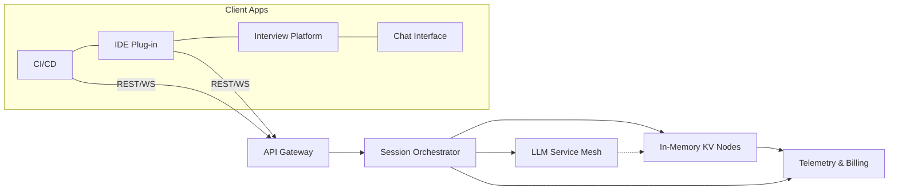

# **Zephra — LLM-Powered Ephemeral Transactional-Store API**

---

## 1. Executive Summary

**Zephra** is a developer-centric, API-only MicroSaaS that delivers a secure, in-memory key–value datastore with full transactional semantics — and layers an LLM-driven intelligence surface on top. It lets engineers spin up ultra-fast, disposable data sandboxes for testing, interview evaluations, feature flagging, and rapid prototypes while enjoying natural-language control, auto-generated tests, and telemetry insights. Because instances are ephemeral and isolated, teams eliminate the overhead of provisioning, persisting, and cleaning traditional databases whenever they need a stateful scratchpad.

---

## 2. Problem Statement

| Challenge                                                                                                                            | Impact on Teams                                       |
| ------------------------------------------------------------------------------------------------------------------------------------ | ----------------------------------------------------- |
| **Boilerplate data scaffolding** for unit tests, coding challenges, and micro-benchmarks slows velocity and inflates CI runtimes.    | Longer feedback loops, higher compute bills.          |
| **Manual state resets** between tests or candidate sessions cause flaky results and hidden dependencies.                             | Undermines trust in results and candidate experience. |
| **Learning curve of transactional logic** (nested rollbacks, commits) forces interviewers and junior devs into repeated reinvention. | Wasted engineering effort and inconsistent pedagogy.  |
| **Lack of observability & context** around transient datasets hinders debugging and performance tuning.                              | More time spent hunting bugs than building value.     |

---

## 3. Vision & Value Proposition

Zephra aspires to be *the* instant data sandbox for every developer workflow that needs transient, transactional state:

* **Spin-up in milliseconds** — per-request isolates with deterministic TTLs.
* **True nested transactions** — mirror real-world database semantics without persistence headaches.
* **Conversational control plane** — leverage Zephra’s integrated LLM to:

  * Translate natural-language intents into API calls and rollback scripts.
  * Auto-generate edge-case test suites from business rules or user stories.
  * Provide inline explanations of transaction outcomes for teaching.
* **Insightful telemetry** — automatic traces, diff visualisation, and cost dashboards.

---

## 4. Core Functionalities

### 4.1 Data & Transaction Layer

* **SET / GET / UNSET** operations with constant-time access.
* **BEGIN / ROLLBACK / COMMIT** with unlimited nesting depth and atomic isolation.
* **Snapshot API** to export or clone current in-memory state for deterministic reproductions.

### 4.2 LLM-Assisted Intelligence

* **Intent Parsing:** “*Create two keys, increment counter five times, then roll everything back*” → Zephra returns a signed batch of API calls.
* **Autograder Mode:** Injects hidden asserts and grading rubrics into candidate sandboxes, returning scored reports.
* **Explain Mode:** Generates plain-English diffs between snapshots to aid onboarding.

### 4.3 Ephemeral Environment Management

* Time-boxed instances (seconds → hours).
* Soft-delete recycle bin to recover recently expired sessions (configurable).
* Namespaced multi-tenant isolation with scoped API tokens.

### 4.4 Observability & Governance

* Real-time metrics: command counts, nested depth, memory footprint.
* Immutable audit log per token for compliance audits.
* Role-based access controls and optional IP policies.

---

## 5. High-Level Architecture

* **API Gateway** — Auth, rate limiting, protocol negotiation.
* **Session Orchestrator** — Creates & tears down isolated KV nodes, routes commands, enforces TTL.
* **In-Memory KV Nodes** — Highly optimized data engines supporting nested transaction stacks.
* **LLM Service Mesh** — Fine-tuned models providing intent parsing, explanation, and test generation.
* **Telemetry & Billing** — Streams metrics, usage, and cost attribution to an analytics lake.

---

## 6. API Design (Endpoint Semantics)

| Endpoint       | Method     | Purpose                                                             |
| -------------- | ---------- | ------------------------------------------------------------------- |
| `/session`     | **POST**   | Create an isolated datastore; returns `session_id`, TTL, endpoints. |
| `/key`         | **PUT**    | `name`, `value` → `SET`.                                            |
| `/key/{name}`  | **GET**    | Retrieve value; returns `NULL` when unset.                          |
| `/key/{name}`  | **DELETE** | `UNSET`.                                                            |
| `/tx`          | **POST**   | `BEGIN` (pushes new frame).                                         |
| `/tx/rollback` | **POST**   | Undo active frame.                                                  |
| `/tx/commit`   | **POST**   | Collapse all frames.                                                |
| `/snapshot`    | **POST**   | Persist current state to snapshot store; returns `snapshot_id`.     |
| `/nlp`         | **POST**   | Natural-language instruction → ordered API call batch.              |
| `/grade`       | **POST**   | Submit candidate solution & rubric; returns JSON rubric scores.     |

*All responses include timing metadata, memory delta, and transaction depth for observability.*

---

## 7. Primary Use Cases

1. **CI Unit-Test Acceleration** – Parallelized, stateless data layers that die when tests finish.
2. **Interview Coding Exercises** – Instant sandboxes with automatic grading and rollback for each candidate.
3. **Ephemeral Feature Flags** – Store toggles during blue-green or canary deployments without touching production config.
4. **Education & Workshops** – Teach ACID principles, transaction isolation, and rollback through interactive labs.
5. **Rapid Prototyping** – Backend engineers validate stateful flows before committing to long-term persistence.

---

## 8. Competitive Landscape

| Alternative              | Gaps Filled by Zephra                                                     |
| ------------------------ | ------------------------------------------------------------------------- |
| Self-hosted Redis in CI  | Setup & teardown complexity; no LLM insights.                             |
| Mock libraries           | Limited fidelity; lack true transactional semantics.                      |
| Cloud KV services        | Designed for persistence; slower provisioning; usage costs for idle data. |
| Interview-only platforms | Narrow focus; no general developer utility or LLM-powered telemetry.      |

Zephra positions itself at the intersection of **speed**, **fidelity**, and **explainability** for transient data needs.

---

## 9. Pricing & Packaging

| Tier               | Monthly Quota                         | LLM Features                    | Support                     |
| ------------------ | ------------------------------------- | ------------------------------- | --------------------------- |
| **Starter** (Free) | 1 GB RAM·hours, 100 sessions          | Limited prompts/hour            | Community forum             |
| **Pro**            | 25 GB RAM·hours, 5 000 sessions       | Unlimited prompts, Explain Mode | 24-h e-mail                 |
| **Team**           | 150 GB RAM·hours, custom session pool | Autograder & Snapshot diff      | Slack channel               |
| **Enterprise**     | SLA-backed dedicated clusters         | Fine-tuned private models       | 1-h response, SOC 2 reports |

Overage billed per RAM·hour and prompt token—simple, predictable.

---

## 10. Growth Strategy

1. **Developer Relations** – Tutorials, open-spec SDKs, and sample GitHub Actions.
2. **Partnerships** – Integrate with major coding interview platforms and CI vendors.
3. **Usage-Based Expansion** – Freemium land-and-expand motion; telemetry highlights value to decision makers.
4. **Thought Leadership** – Publish transaction-debugging case studies and LLM best practices.

---

## 11. Product Roadmap

| Quarter | Milestone                                                                    |
| ------- | ---------------------------------------------------------------------------- |
| **Q1**  | Beta launch, REST interface, single-tenant MVP.                              |
| **Q2**  | LLM Explain Mode, multi-tenant isolation, OpenAPI docs.                      |
| **Q3**  | Autograder Mode, CLI tooling, metrics dashboards.                            |
| **Q4**  | Snapshot cloning, enterprise compliance (SOC 2, GDPR), custom prompt tuning. |

---

## 12. Security & Compliance Highlights

* **Zero-persist guarantee**: memory-only unless snapshot explicitly created.
* **End-to-end encryption** in transit; optional encryption-in-use via hardware enclaves.
* **Per-session sandbox isolation** prevents cross-tenant leakage.
* **Comprehensive audit trails** streamed to customer SIEM via webhook.
* **Compliance targets**: SOC 2 Type II, ISO 27001, GDPR, HIPAA (optional BAA).

---

## 13. Key Metrics & KPIs

| Category       | Metric                                              |
| -------------- | --------------------------------------------------- |
| Adoption       | MAUs, sessions per dev, SDK downloads               |
| Performance    | Median spin-up latency, commands/sec, rollback time |
| LLM Engagement | Prompts per session, intent success rate            |
| Revenue        | ARPU, gross margin, expansion MRR                   |
| Reliability    | 99.9 % uptime, P95 response latency                 |

---

## 14. Implementation Phases (High Level)

1. **Core Engine** — deterministic in-memory KV store with transaction stack.
2. **API & Auth** — secure HTTPS endpoints, token issuance, rate limiting.
3. **LLM Integration** — prompt engineering, fine-tuning, and safety guardrails.
4. **Telemetry & Billing** — real-time event stream to analytics pipeline.
5. **UX Tooling** — CLI, ChatOps bot, and lightweight Web Console.

---

## 15. Community & Open-Source Angle

* **Open API specification** and **client SDKs** under permissive license to encourage ecosystem growth.
* **Plugin system** for custom LLM prompt templates and grading rubrics.
* **Public roadmap & RFC process** giving contributors influence over features.
* **Hackathon sponsorships** to seed innovative use-cases.

---

## 16. Risks & Mitigations

| Risk                       | Mitigation                                                                    |
| -------------------------- | ----------------------------------------------------------------------------- |
| Sudden LLM cost spikes     | Usage-based throttling, model distillation, and prompt caching.               |
| Abuse (e.g., key-scraping) | Adaptive rate limits, anomaly detection, abuse-reporting pipeline.            |
| Data sensitivity concerns  | Zero-persist by default, customer-owned encryption keys for snapshots.        |
| Competitive replication    | First-mover brand building, developer love through transparency and velocity. |

---

### **Call to Action**

Zephra turns the mundane act of creating disposable data stores into a delightful, LLM-enhanced experience. Join the waitlist, contribute to the open specification, and help redefine how the world prototypes, teaches, and validates stateful logic—*without ever spinning up a server or writing boilerplate cleanup code again.*
