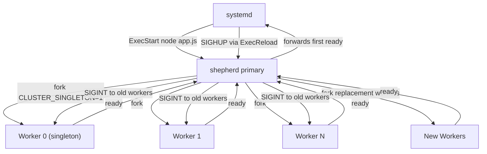

# OSS Package Proposal: `shepherd`

## The Problem This PR Exposed

This PR replaced PM2 with Node.js native clustering under systemd. In doing so, it had to re-implement from scratch every runtime capability PM2 provided that the raw `node:cluster` module does not include:

- Zero-downtime rolling restarts on SIGHUP
- Singleton worker pattern (exactly one process runs Slack, cron gates, etc.)
- Crash recovery that correctly distinguishes intentional kills from unexpected exits
- Re-entrancy guards for concurrent signals (SIGHUP during shutdown, SIGHUP during SIGHUP)
- Graceful HTTP drain with dual timeouts (drain + async cleanup)
- Primary fallback timeout derived from worker budget rather than a magic number
- Forwarding the first worker `ready` signal to systemd so readiness polling works

All of this ended up in two new files (`utils/cluster.js` and `utils/gracefulShutdown.js`) totalling roughly 230 lines of carefully guarded state machine code. Every bug fixed in this branch (surplus re-forks, premature reload unlock, post-ready crash not re-forked, shutdown hang during rolling restart) came from the inherent complexity of driving this state machine correctly.

Every Node.js team that migrates from PM2 to systemd will write the same 230 lines and make the same mistakes.

---

## The Package Idea

**`shepherd`** -- a zero-dependency, systemd-native Node.js cluster manager.

It encapsulates exactly what this PR built: a primary process that manages workers, drives rolling restarts on SIGHUP, tracks singleton workers, handles all crash recovery edge cases, and shuts down cleanly. The application provides a two-call integration. The rest is handled internally.

```
npm install shepherd
```

---

## Design Goals

- **Zero external dependencies.** Uses only `node:cluster`, `node:process`, and `node:http`. No PM2, no `sd-notify`, no native addons.
- **systemd-native.** Designed around `Type=simple` with `ExecReload=/bin/kill -HUP $MAINPID`. The rolling restart is triggered by the OS signal, not by an in-band HTTP endpoint or a CLI tool.
- **No port collision.** The primary owns the socket exclusively via `cluster.fork()`. Workers inherit the handle; the OS never assigns the port to individual workers directly.
- **No ghost processes.** systemd supervises only the primary PID. If the primary dies, systemd restarts it. Workers that crash are re-forked by the primary.
- **Correct by construction.** The rolling restart state machine is encoded once, tested once, and imported -- not copy-pasted per project.

---

## API

### Primary entry point (`app.js`)

```js
const { createCluster, isWorker } = require('shepherd');

if (!isWorker()) {
  createCluster({
    workerCount: parseInt(process.env.CLUSTER_WORKERS, 10) || 2,
    drain: 10_000,    // ms to wait for HTTP connections to close
    cleanup: 3_000,   // ms for async cleanup after drain
  });
} else {
  startApp();
}
```

`createCluster` forks `workerCount` workers, sets up all signal handlers, and drives the lifecycle. It never returns.

### Worker entry point (`server.js`)

```js
const { gracefulShutdown, isSingleton, ready } = require('shepherd');

// Register the HTTP server for graceful drain on shutdown signals.
gracefulShutdown(server, asyncCleanup);

// Gate singleton-only tasks behind this flag.
if (isSingleton()) {
  startSlackSocketMode();
  startCronScheduler();
}

// Signal to the primary that this worker is fully initialized.
ready();
```

`ready()` sends a message to the primary, which forwards the first call to systemd (`process.send('ready')`). The primary then SIGINTs the corresponding old worker.

---

## Architecture



---

## Rolling Restart State Machine

The hardest part of this PR to get right was the rolling restart state machine. `shepherd` encodes it internally so consumers never touch it.

The state machine tracks five pieces of internal state:

- `isShuttingDown`: set on SIGINT or SIGTERM; blocks new reloads
- `isReloading`: set on SIGHUP; blocks concurrent reloads
- `rollingRestartWorkerIds`: old workers killed intentionally; exit handler skips re-fork
- `reloadingNewWorkerIds`: new workers still pending `ready`; drives `isReloading` clear
- `rollingRestartNewWorkerIds`: all new workers across their entire lifetime (pre and post `ready`); allows re-forking post-ready crashes while suppressing re-forking of pre-SIGHUP old workers

The re-fork decision for any worker exit reduces to:

```
re-fork = !isShuttingDown AND (!isReloading OR rollingRestartNewWorkerIds.has(worker.id))
```

The seven crash scenarios this covers correctly:

| Scenario | isReloading | in rollingRestartNewWorkerIds | Re-forked |
|---|:---:|:---:|:---:|
| Normal crash, no reload active | false | false | Yes |
| Old worker crashes during rolling restart | true | false | No |
| New worker crashes before `ready` | true | true | Yes |
| New worker crashes after `ready`, others still pending | true | true | Yes |
| All new workers crash | true | true | Yes |
| Concurrent SIGHUP dropped by guard | -- | -- | N/A |
| Shutdown during rolling restart | shutting down | -- | No |

---

## Graceful Shutdown

`gracefulShutdown(server, asyncCleanup)` registers SIGINT and SIGTERM handlers that run this sequence:

1. Set re-entrancy guard (double-signal safe)
2. Start a `drain` ms force-exit timer (`.unref()` so it does not keep the event loop alive)
3. Call `server.close()` to stop accepting new connections immediately
4. Await existing connections to drain naturally
5. On drain: clear force-exit timer, start a `cleanup` ms timer, await `asyncCleanup(exitCode)`
6. Clear cleanup timer, call `process.exit(exitCode)`

The primary's own fallback timeout is derived from the worker budget:

```
PRIMARY_TIMEOUT = drain + cleanup + 2000ms overhead
```

This ensures the primary always waits long enough for workers to finish before force-killing them, and never picks a magic number that drifts from the actual worker budget.

---

## systemd Integration

A minimal unit file for a `shepherd`-managed service:

```ini
[Unit]
Description=my-app
After=network.target

[Service]
Type=simple
WorkingDirectory=/srv/my-app
ExecStart=node --max-old-space-size=4096 app.js
ExecReload=/bin/kill -HUP $MAINPID
KillSignal=SIGINT
TimeoutStopSec=20
Restart=on-failure

[Install]
WantedBy=default.target
```

Deploy workflow:

```bash
git pull && npm ci
systemctl --user reload-or-restart my-app
```

On first deploy (no `ExecReload` yet): `reload-or-restart` falls back to a full restart automatically. Once the new primary is running and `ExecReload` is in the unit file, every subsequent deploy is a zero-downtime SIGHUP.

---

## Comparison with PM2

| Capability | PM2 cluster mode | Raw `node:cluster` | `shepherd` |
|---|:---:|:---:|:---:|
| Zero-downtime rolling restart | Yes (`pm2 reload`) | No | Yes (SIGHUP) |
| Singleton worker pattern | No | No | Yes |
| Correct crash re-fork during reload | Partial | No | Yes |
| Graceful HTTP drain on shutdown | Via `kill_timeout` | No | Yes |
| Async cleanup timeout guard | No | No | Yes |
| systemd-native (no extra process) | No | No | Yes |
| Port collision risk | Yes (IPC bridge failures) | No | No |
| Ghost process risk | Yes | No | No |
| External runtime dependency | Yes (`pm2` daemon) | No | No |
| Zero npm dependencies | No | Yes | Yes |

---

## What `shepherd` Does Not Do

- No log file management (use journald)
- No CPU/memory restart thresholds (use `MemoryMax` in the unit file and `OOMPolicy=stop`)
- No dashboard or web UI
- No multi-host orchestration (use Kubernetes for that)
- No Windows support (signal semantics are POSIX-only)

These are deliberate omissions. Each of them is the responsibility of the OS or the orchestrator, not the process manager.

---

## Why This Should Exist

PM2 is a process manager that predates reliable systemd support in Linux distributions. It solves problems (daemonization, log management, cluster restart) that systemd now solves better at the OS level. But PM2 also solved one problem systemd genuinely cannot solve on its own: zero-downtime rolling restarts across cluster workers within a single service unit.

The gap is narrow but real. `shepherd` fills exactly that gap: it adds rolling restart logic and singleton worker semantics on top of `node:cluster`, integrates cleanly with systemd supervision, and does nothing else.

Every team that hits this gap today either stays on PM2 with its reliability problems or writes the same 200-line state machine from scratch. `shepherd` makes the correct implementation a one-line install.
