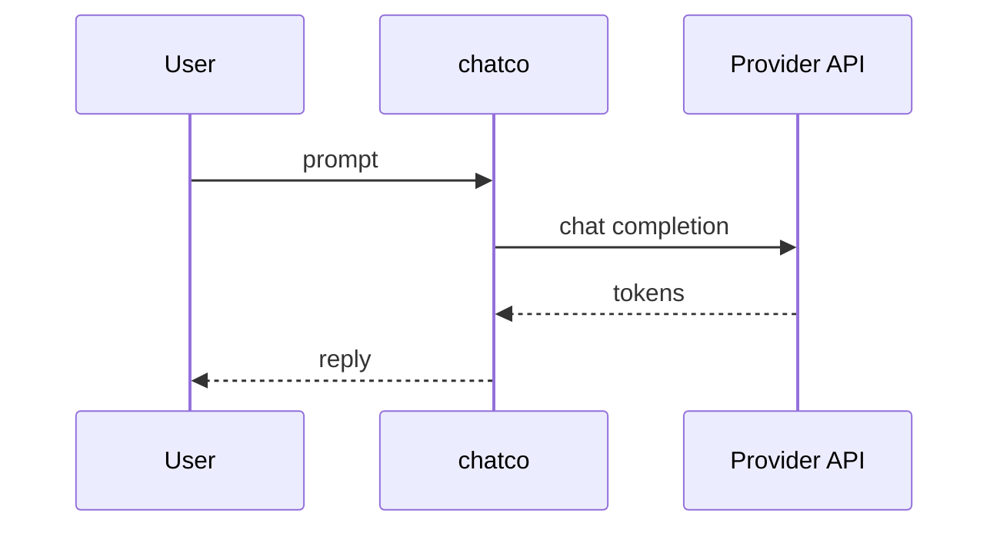

# ChatCo

*Terminal-native LLM chat CLI with persistent conversation history, multi-model support, and system prompt management.*

> **PyPI:** `chatco` (confirm availability before publish, HTTP 404 check recommended)
> **npm:** `chatco` (confirm availability before publish, HTTP 404 check recommended)

---

## Problem Statement

- shell_gpt, aichat, and Simon Willison's `llm` tool all work but lack conversation threading, cost tracking, and system prompt versioning in a single cohesive tool
- Developers using LLMs daily need a terminal-native chat tool that stores full conversation history locally for review and replay
- Switching between models mid-conversation requires restarting most CLI tools; no tool supports in-session model switching
- No local CLI chat tool tracks token usage and inferred cost per session without a separate observability platform

ChatCo is the developer-first LLM terminal chat: persistent threads, multi-model, cost tracking, and system prompt management.

---

## Core Features

### Persistent Conversation Management
- Named conversation threads stored in local SQLite with full message history
- Resume any conversation by name: `chatco chat my-project-planning`
- Branch conversations: fork from any message point to explore alternatives

### Multi-Model Support
- Switch models within a session: `chatco model switch claude-3-5-sonnet`
- Supported at launch: OpenAI (GPT-4o, GPT-4o-mini), Anthropic (Claude 3.5), Ollama (local)
- Per-conversation model override with global default in config

### System Prompt Management
- Define and version named system prompts as reusable templates
- `chatco prompt use coding-assistant` sets the system prompt for a new thread
- Prompt library stored locally; import/export as YAML

---

## Interaction Sequence



---

## CLI Commands

```bash
# Start a new conversation
chatco new "planning the ForkCo CLI"

# Resume an existing conversation
chatco chat forkco-planning

# Send a one-shot message (no history)
chatco ask "What is the capital of France?"

# Switch model for current session
chatco model switch gpt-4o-mini

# Save a system prompt
chatco prompt save "coding-assistant" --file system-prompts/coding.txt

# Use a system prompt in a new chat
chatco new "code review session" --prompt coding-assistant

# Show token usage and cost for a conversation
chatco stats forkco-planning

# List all conversations
chatco list
```

---

## Configuration

```yaml
# ~/.chatco/config.yml
default_model: gpt-4o-mini

providers:
  openai:
    api_key: ${OPENAI_API_KEY}
  anthropic:
    api_key: ${ANTHROPIC_API_KEY}
  ollama:
    base_url: http://localhost:11434

cost_tracking:
  enabled: true
  alert_per_session_usd: 1.00

display:
  markdown_render: true
  stream: true
```

---

## 7-Day Build Plan

| Day | Focus | Deliverable |
|-----|-------|-------------|
| 1 | Project scaffold | CLI entry point (Typer), SQLite schema for conversations + messages, config loader |
| 2 | OpenAI + Anthropic integration | Streaming responses; multi-turn conversation context management |
| 3 | Ollama local model support | Ollama API client; local model streaming |
| 4 | Conversation threading | `new/chat/list`; named threads; resume from last message |
| 5 | System prompt library | `prompt save/use/list`; YAML import/export; per-thread prompt |
| 6 | Cost tracking + stats | Token + cost tracking per message; `stats` command; alert on threshold |
| 7 | Packaging + publish | `pip install chatco`, `npm install -g chatco`, README, PyPI + npm release |

---

## Simple Data Model

```json
// ~/.chatco/conversations.db  (SQLite)
{
  "conversations": {
    "conv-uuid": {
      "name": "forkco-planning",
      "model": "gpt-4o-mini",
      "system_prompt": "coding-assistant",
      "total_tokens": 12450,
      "total_cost_usd": 0.0186,
      "created_at": "2026-03-28T10:00:00Z"
    }
  },
  "messages": {
    "msg-uuid": {
      "conversation_id": "conv-uuid",
      "role": "user",
      "content": "How should I structure the CLI commands for ForkCo?",
      "timestamp": "2026-03-28T10:00:00Z"
    }
  }
}
```

---

## Installation

```bash
# PyPI (Python CLI)
pip install chatco

# npm (global binary)
npm install -g chatco
```

---

## Stack

- **Language:** Python 3.11+
- **CLI framework:** Typer + Rich (markdown-rendered chat output, streaming)
- **LLM:** openai, anthropic SDK clients; Ollama REST API via `httpx`
- **Storage:** SQLite via stdlib `sqlite3`
- **Config:** PyYAML
- **Packaging:** hatch for PyPI; package.json wrapper for npm binary

---

## Market Positioning

- **Target users:** Developers using LLMs daily from the terminal, AI engineers testing prompts across multiple models, indie hackers who live in the terminal
- **YC/A16Z alignment:** YC W26: AI developer tools are the top batch theme (60% of batch is AI); A16Z 2026: terminal-native AI tools growing as developer workflow layer
- **Key differentiator:** The only terminal LLM chat tool with named persistent threads, in-session model switching, system prompt versioning, and per-session cost tracking in one local tool
- **Closest competitors:**
  - shell_gpt: one-shot only; no persistent threads; no cost tracking
  - Simon Willison's `llm`: excellent for one-shots; conversation management is secondary; no system prompt library
  - aichat: good multi-model support; no system prompt versioning; no cost tracking

---

## Success Metrics (6 months)

- PyPI downloads: target 1,000/month
- GitHub stars: target 200-600
- Active contributors: target 8+
- LLM providers at launch: OpenAI, Anthropic, Ollama; Gemini by month 2
