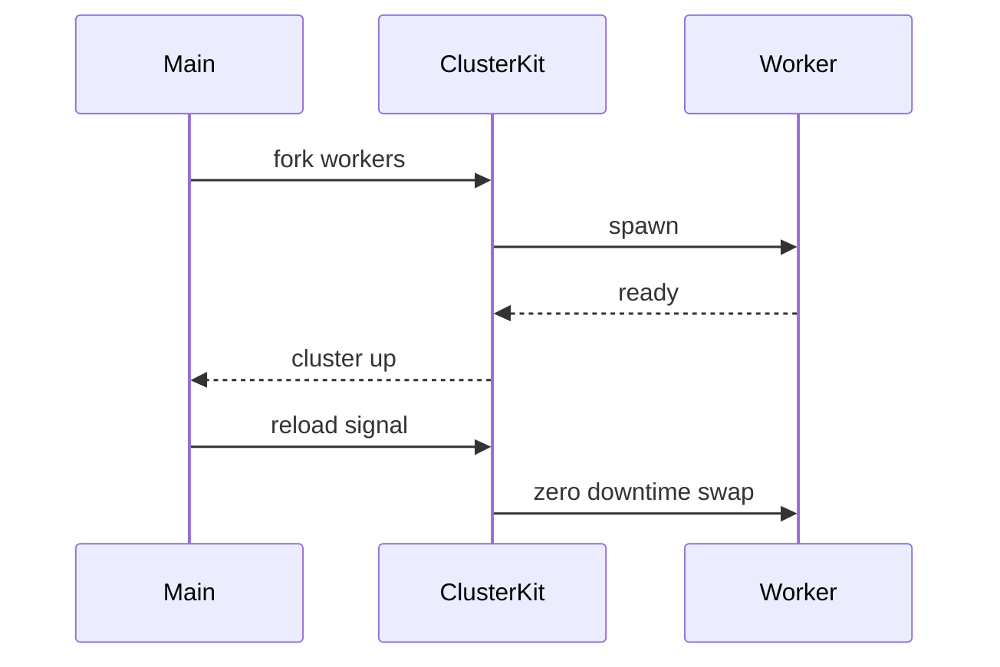

# ClusterKit

*Zero-downtime Node.js cluster management library for teams migrating from PM2 to systemd.*

> **npm:** `clusterkit` (confirm availability before publish, HTTP 404 check recommended)
> **PyPI:** N/A (Node.js library)

---

## Problem Statement

- Every Node.js team migrating from PM2 to native `node:cluster` + systemd writes the same ~230 lines of state machine code and makes the same mistakes
- Raw `node:cluster` provides none of PM2's runtime capabilities: no zero-downtime rolling restarts, no singleton worker enforcement, no crash recovery logic
- Re-entrancy bugs (SIGHUP during shutdown, SIGHUP during SIGHUP) cause production hangs that are hard to reproduce
- No reusable, well-tested library exists that wraps these patterns; teams copy-paste fragile scripts instead

ClusterKit encapsulates the full PM2-to-systemd migration boilerplate into a tested, drop-in Node.js module.

---

## Core Features

### Zero-Downtime Rolling Restarts
- Handles SIGHUP to trigger rolling worker replacement without dropping connections
- Drains active HTTP connections with configurable drain timeout before killing old workers
- Re-entrancy guards prevent overlapping restarts when SIGHUP fires during an in-progress restart

### Singleton Worker Pattern
- Ensures exactly one worker runs singleton processes (Slack, cron gates, scheduled jobs)
- Prevents duplicate singleton spawning after worker crashes
- Configurable singleton tags per worker role

### Crash Recovery State Machine
- Distinguishes intentional kills from unexpected exits
- Re-forks crashed workers with exponential backoff
- Does not re-fork on intentional `process.exit()` calls from the application

### Systemd Integration
- Sends `READY=1` to systemd via the first worker's ready signal
- Compatible with `sd_notify` and `WatchdogSec` for liveness checks
- Primary fallback timeout derived from worker budget (no magic numbers)

---

## Interaction Sequence



---

## API

```javascript
import { ClusterKit } from 'clusterkit';

const cluster = new ClusterKit({
  workers: 4,
  singletons: ['slack-bot', 'cron-runner'],
  drainTimeoutMs: 5000,
  cleanupTimeoutMs: 3000,
  restartOnCrash: true,
  backoffMs: [100, 500, 2000],
});

cluster.start('./src/server.js');
```

---

## 7-Day Build Plan

| Day | Focus | Deliverable |
|-----|-------|-------------|
| 1 | Project scaffold | TypeScript setup, `ClusterKit` class skeleton, test harness (Vitest) |
| 2 | SIGHUP rolling restart | Fork replacement; drain timeout; old worker kill sequence |
| 3 | Re-entrancy guards | SIGHUP-during-shutdown and SIGHUP-during-SIGHUP state machine |
| 4 | Singleton worker pattern | Singleton tag registry; re-fork guard for singleton roles |
| 5 | Crash recovery | Exit code classification; exponential backoff re-fork; intentional-kill detection |
| 6 | Systemd integration | `sd_notify` READY signal; watchdog keepalive; fallback timeout derivation |
| 7 | Packaging + publish | `npm publish`, TypeScript types, README, migration guide from PM2 |

---

## Simple Data Model

```typescript
// Internal state (in-process, not persisted)
interface WorkerState {
  id: number;
  pid: number;
  role: 'standard' | 'singleton';
  singletonTag?: string;
  status: 'starting' | 'ready' | 'draining' | 'exited';
  startedAt: Date;
  crashCount: number;
}

interface ClusterState {
  phase: 'idle' | 'rolling-restart' | 'shutdown';
  workers: Map<number, WorkerState>;
  restartLock: boolean;
}
```

---

## Installation

```bash
# npm (Node.js library)
npm install clusterkit
```

---

## Stack

- **Language:** TypeScript (Node.js 20+)
- **Cluster API:** Node.js built-in `node:cluster`
- **Systemd integration:** `sd-notify` npm package
- **Testing:** Vitest + process lifecycle mocks
- **Packaging:** `tsup` for dual CJS/ESM build; published to npm

---

## Market Positioning

- **Target users:** Node.js backend engineers migrating from PM2 to systemd, platform teams standardizing on systemd for Node.js deployments, SREs who need predictable zero-downtime restart behavior
- **YC/A16Z alignment:** YC W26: infrastructure reliability tooling; A16Z 2026: developer experience improvements for production Node.js deployments
- **Key differentiator:** The only drop-in Node.js library that implements the full PM2 runtime feature set (rolling restarts, singleton workers, crash recovery, systemd readiness) on top of raw `node:cluster` with a tested state machine
- **Closest competitors:**
  - PM2: full process manager but introduces a separate daemon; not composable; hard to customize
  - `throng`: simple cluster forking; no rolling restarts or singleton patterns
  - Raw `node:cluster`: requires writing all state machine code from scratch

---

## Success Metrics (6 months)

- npm weekly downloads: target 2,000/week
- GitHub stars: target 300-800
- Active contributors: target 8+
- Production adoption: 5+ confirmed production deployments by month 3
