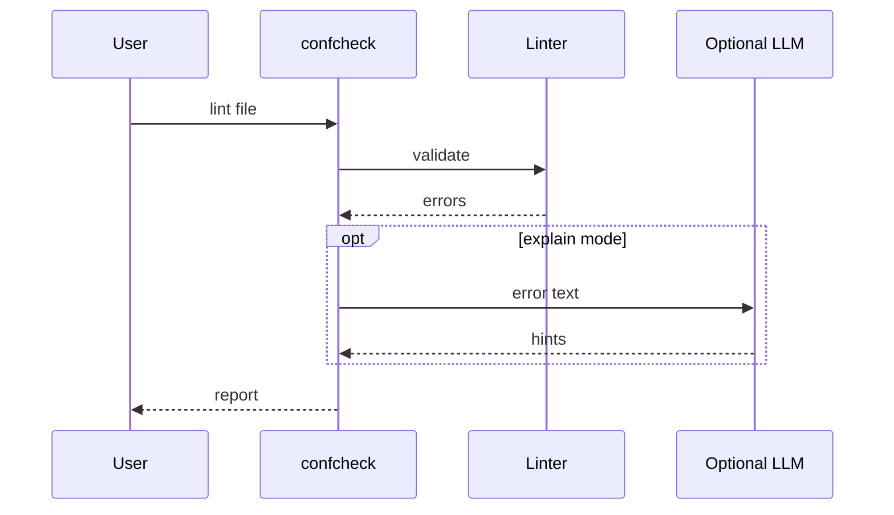

# ConfCheck

*Multi-format infrastructure config linter with optional LLM diagnostics: YAML, JSON, HCL for AWS/GCP/k8s.*

> **PyPI:** `confcheck` (confirmed available, HTTP 404)
> **npm:** `confcheck` (confirmed available, HTTP 404)

---

## Problem Statement

- Configuration errors are among the most expensive failure modes in cloud infrastructure
- Existing tools (yamllint, jsonschema, kubeval) are single-format, single-provider, or require cloud access
- No local, multi-format, multi-provider config linter exists with optional LLM-powered diagnostics
- DevOps teams write one-off validation scripts per project rather than using a reusable, extensible linting tool

ConfCheck is fully local: multi-format (YAML/JSON/HCL), multi-provider (AWS/GCP/k8s), with optional LLM insights using the user's own API key.

---

## Core Features

### Multi-Format Linting
- Validates YAML, JSON, and HCL (Terraform) files for syntax errors and structural issues
- Provider-specific rule packs: AWS CloudFormation, GCP Deployment Manager, Kubernetes manifests, generic
- Auto-format mode that applies consistent indentation and style without changing semantics

### Extensible Rule Engine
- Rule packs defined in JSON Schema + custom rule YAML
- Community rule packs installable via `confcheck install-pack <pack-name>`
- Custom rule authoring with YAML DSL for org-specific standards

### Optional LLM Diagnostics
- Optional mode using OpenAI or Anthropic to explain errors in plain English and suggest fixes
- User provides API key; no config content sent to any service without explicit opt-in
- LLM suggestions stored locally alongside validation results for review

---

## Interaction Sequence



---

## CLI Commands

```bash
# Lint a config file
confcheck lint myconfig.yaml

# Lint with a specific provider rule pack
confcheck lint deployment.yml --provider kubernetes

# Auto-format a config file
confcheck format terraform.tf

# Get LLM-powered fix explanation
confcheck explain myconfig.yaml --llm

# Simulate config changes (static diff)
confcheck diff old-config.yaml new-config.yaml

# Install a community rule pack
confcheck install-pack aws-security

# List active rule packs
confcheck packs list
```

---

## Configuration

```yaml
# .confcheck.yml
providers:
  - kubernetes
  - aws

rule_packs:
  - generic
  - aws-security

llm:
  provider: openai
  model: gpt-4o-mini
  api_key: ${OPENAI_API_KEY}
  enabled: false            # opt-in only

output:
  format: table             # table | json | sarif
  max_warnings: 50
```

---

## 7-Day Build Plan

| Day | Focus | Deliverable |
|-----|-------|-------------|
| 1 | Project scaffold | CLI entry point (Typer), config loader, test harness; YAML/JSON/HCL parsers |
| 2 | Core lint engine | Syntax validation; JSON Schema rule application; colored error output with line numbers |
| 3 | Provider rule packs | AWS, GCP, Kubernetes rule packs; extensible pack loader |
| 4 | Auto-format command | Safe in-place formatting for YAML/JSON/HCL |
| 5 | Static diff + custom rules | `diff` command; custom rule YAML DSL; `install-pack` command |
| 6 | LLM diagnostics mode | OpenAI/Anthropic error explanation; suggestion storage; `explain` command |
| 7 | Packaging + publish | `pip install confcheck`, `npm install -g confcheck`, README, PyPI + npm release |

---

## Simple Data Model

```json
// ~/.confcheck/state.json  (auto-maintained)
{
  "validations": {
    "myconfig.yaml": {
      "last_validated": "2026-03-28T10:00:00Z",
      "status": "fail",
      "error_count": 3,
      "warning_count": 7,
      "format": "yaml",
      "provider": "kubernetes"
    }
  },
  "rule_packs": ["aws", "kubernetes", "generic", "aws-security"]
}
```

---

## Installation

```bash
# PyPI (Python CLI)
pip install confcheck

# npm (global binary)
npm install -g confcheck
```

---

## Stack

- **Language:** Python 3.11+
- **CLI framework:** Typer + Rich (lint output with line numbers and colored severity)
- **Parsers:** `PyYAML`, `json` (stdlib), `python-hcl2` for HCL/Terraform
- **Rule engine:** `jsonschema` + custom rule YAML loader
- **LLM optional:** openai, anthropic SDK clients (user provides API key)
- **Config:** PyYAML (`.confcheck.yml`)
- **Packaging:** hatch for PyPI; npm publish for npm binary

---

## Market Positioning

- **Target users:** DevOps engineers validating cloud configs before deployment, platform teams enforcing configuration standards in CI, SREs auditing infrastructure configs
- **YC/A16Z alignment:** YC W26: infrastructure automation tools are top batch theme; A16Z 2026: AI-augmented DevOps in top developer-tools priorities
- **Key differentiator:** The only multi-format (YAML/JSON/HCL), multi-provider (AWS/GCP/k8s) local config linter with optional LLM-powered diagnostics, no cloud calls required for core validation
- **Closest competitors:**
  - yamllint: YAML-only; no provider-specific rule packs; no LLM diagnostics
  - kubeval: Kubernetes-only; requires schema downloads; no HCL or AWS support
  - Checkov: cloud-dependent; complex setup; not local-first

---

## Success Metrics (6 months)

- PyPI downloads: target 5,000/month
- GitHub stars: target 300-1,000
- Active contributors: target 15+
- Config formats at launch: YAML, JSON, HCL; provider packs: AWS, GCP, Kubernetes
