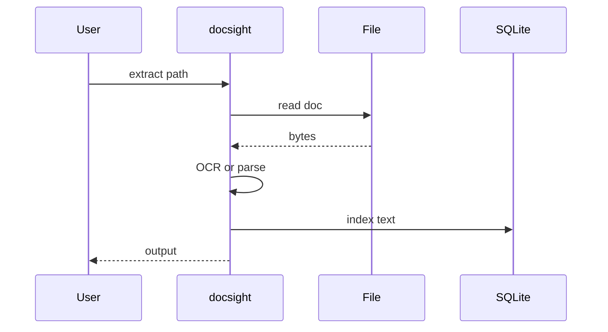

# DocSight

*Local document analysis CLI: extract, summarize, and query PDF, DOCX, and TXT files without cloud uploads.*

> **PyPI:** `docsight` (confirm availability before publish, HTTP 404 check recommended)
> **npm:** `docsight` (confirm availability before publish, HTTP 404 check recommended)

---

## Problem Statement

- A16Z 2026: 80% of corporate knowledge lives in unstructured formats (PDFs, DOCX, TXT) that LLMs cannot access without extraction
- Enterprise tools (Adobe Extract API, AWS Textract) are expensive, require cloud uploads, and create privacy risks for sensitive documents
- Manual copy-paste from documents into LLM prompts is error-prone, truncated, and leaks PII to third-party services
- No open-source CLI runs locally, extracts structured content from multiple formats, and enables natural language queries without a cloud call

DocSight extracts, summarizes, and queries documents entirely locally with optional LLM using the user's own API key.

---

## Core Features

### Multi-Format Extraction
- Full text extraction from PDF (with `pdfminer.six` and `pymupdf`), DOCX (`python-docx`), TXT, and Markdown
- Metadata extraction: title, author, page count, word count, creation date
- Table detection and extraction for structured data within documents

### LLM-Powered Analysis
- Summarization per document or per section with configurable summary length
- Natural language query mode: "What are the contract termination clauses?" against extracted text
- Topic and keyword extraction; named entity recognition (person, org, date)

### Document Library
- Local SQLite database of extracted documents with full-text search
- Tag documents for project-based organization
- Cache extracted text to avoid re-processing unchanged files

---

## Interaction Sequence



---

## CLI Commands

```bash
# Extract text from a document
docsight extract report.pdf

# Summarize a document
docsight summarize contract.pdf --length short

# Query a document with natural language
docsight ask contract.pdf "What are the termination clauses?"

# Add a document to the local library
docsight add report.pdf --tags finance,q1-2026

# Search across all documents in the library
docsight search "renewal terms"

# Extract tables from a PDF
docsight tables financials.pdf

# Batch analyze a folder of documents
docsight batch ./contracts/ --command summarize --output summaries/
```

---

## Configuration

```yaml
# ~/.docsight/config.yml
llm:
  provider: openai
  model: gpt-4o-mini
  api_key: ${OPENAI_API_KEY}
  token_budget: 4000
  chunk_size: 2000           # tokens per chunk for long documents

analysis:
  default_summary_length: medium   # short | medium | long
  ner_entities: [person, org, date, location]

library:
  db_path: ~/.docsight/documents.db
```

---

## 7-Day Build Plan

| Day | Focus | Deliverable |
|-----|-------|-------------|
| 1 | Project scaffold | CLI entry point (Typer), SQLite schema for documents + extractions, config loader |
| 2 | PDF extraction | `pdfminer.six` + `pymupdf` text extraction; metadata; page-by-page chunking |
| 3 | DOCX + TXT extraction | `python-docx` DOCX parser; TXT/Markdown reader; unified extraction schema |
| 4 | LLM summarization | Chunk-and-summarize with OpenAI/Anthropic/Ollama; `summarize` command |
| 5 | NL query mode | `ask` command; chunk retrieval; LLM answer from relevant sections |
| 6 | Table extraction + library | `tabula-py` table extraction; SQLite document library; full-text search |
| 7 | Packaging + publish | `pip install docsight`, `npm install -g docsight`, README, PyPI + npm release |

---

## Simple Data Model

```json
// ~/.docsight/documents.db  (SQLite)
{
  "documents": {
    "doc-uuid": {
      "filename": "contract.pdf",
      "file_type": "pdf",
      "word_count": 12450,
      "page_count": 28,
      "tags": ["legal", "q1-2026"],
      "extracted_at": "2026-03-28T10:00:00Z"
    }
  },
  "analyses": {
    "analysis-uuid": {
      "doc_id": "doc-uuid",
      "type": "summary",
      "content": "The contract establishes a 12-month SaaS agreement...",
      "created_at": "2026-03-28T10:00:00Z"
    }
  }
}
```

---

## Installation

```bash
# PyPI (Python CLI)
pip install docsight

# npm (global binary)
npm install -g docsight
```

---

## Stack

- **Language:** Python 3.11+
- **CLI framework:** Typer + Rich (extraction progress, query output)
- **PDF extraction:** `pdfminer.six` + `pymupdf` (fallback for scanned PDFs)
- **DOCX parsing:** `python-docx`
- **Table extraction:** `tabula-py`
- **LLM:** openai, anthropic, ollama SDK clients (optional)
- **Storage:** SQLite via stdlib `sqlite3`
- **Config:** PyYAML
- **Packaging:** hatch for PyPI; package.json wrapper for npm binary

---

## Market Positioning

- **Target users:** Researchers extracting data from academic papers, analysts processing financial reports, compliance teams reviewing contracts locally
- **YC/A16Z alignment:** A16Z Big Ideas 2026: multimodal data management and unstructured data taming as a generational opportunity; YC W26: AI document intelligence top batch theme
- **Key differentiator:** Local-first document extraction CLI supporting PDF/DOCX/TXT with optional LLM summarization using the user's own API key; zero cloud upload; full data privacy
- **Closest competitors:**
  - AWS Textract: cloud-only; expensive; requires AWS credentials; privacy risk
  - Adobe Extract API: SaaS; per-page pricing; privacy concerns
  - `pdfminer.six`: Python library only; no CLI; no NL query interface

---

## Success Metrics (6 months)

- PyPI downloads: target 2,000/month
- GitHub stars: target 200-800
- Active contributors: target 10+
- Document formats at launch: PDF, DOCX, TXT, Markdown; PowerPoint (PPTX) by month 3
