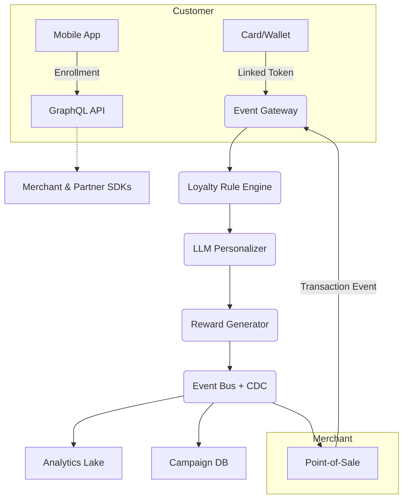

# **Fidelion**

*Reimagining Customer Loyalty Through Open-Source AI Personalization*

---

## Table of Contents

1. [Executive Summary](#executive-summary)
2. [Vision & Mission](#vision--mission)
3. [Core Value Proposition](#core-value-proposition)
4. [Key Differentiators](#key-differentiators)
5. [Functional Architecture](#functional-architecture)
6. [Top Product Functions](#top-product-functions)
7. [Primary Use-Case Flows](#primary-use-case-flows)
8. [Business Model Canvas](#business-model-canvas)
9. [Open-Source Strategy & Governance](#open-source-strategy--governance)
10. [Minimal Viable Product (MVP)](#minimal-viable-product-mvp)
11. [Evolution Roadmap](#evolution-roadmap)
12. [Community & Contribution Guide](#community--contribution-guide)
13. [Risks & Mitigations](#risks--mitigations)
14. [Impact Metrics](#impact-metrics)
15. [Closing Thoughts](#closing-thoughts)

---

## Executive Summary

**Fidelion** is an open-source, LLM-powered loyalty orchestration platform that replaces fragmented card-based schemes with a unified digital layer, seamlessly embedded in point-of-sale (PoS), e-commerce, and mobile channels. By combining real-time transaction capture with generative-AI personalization, Fidelion turns raw purchase events into **actionable, hyper-personal rewards** that drive repeat business while returning full data ownership to merchants.

---

## Vision & Mission

| Aspect      | Statement                                                                                                                                                              |
| ----------- | ---------------------------------------------------------------------------------------------------------------------------------------------------------------------- |
| **Vision**  | A world where every purchase is the start of a smarter, mutually rewarding relationship between shoppers and brands.                                                   |
| **Mission** | To democratize advanced loyalty technology by delivering an open, transparent, and extensible platform that any business—large or small—can adopt, adapt, and improve. |

---

## Core Value Proposition

1. **Zero-Friction Loyalty** – Customers redeem rewards automatically through card-on-file or wallet links; no QR scans or plastic cards.
2. **AI-Driven Personalization** – An embedded LLM analyzes basket context, historical spend, and customer preferences to propose the *next-best incentive* in real time.
3. **Full Data Sovereignty** – On-prem or private-cloud deploy options ensure merchants keep first-party data under their own compliance umbrella.
4. **Composable & Extensible** – Modular service boundaries, event streams, and plugin hooks let integrators replace, extend, or innovate on any subsystem without lock-in.
5. **Community-Led Innovation** – An OSI-approved license, public roadmap, and merit-based governance guarantee a vibrant ecosystem of contributors, extensions, and vertical packs.

---

## Key Differentiators

| Category                      | Fidelion Advantage                                                                                                                                                    |
| ----------------------------- | --------------------------------------------------------------------------------------------------------------------------------------------------------------------- |
| **Hyper-Personal Rewards**    | LLM synthesizes transactional, demographic, and behavioral vectors to craft dynamic incentives (e.g., “10 % off eco-friendly brands you purchased twice last month”). |
| **Adaptive Journey Mapping**  | Federated embeddings capture longitudinal customer intent, letting marketers A/B test *journeys* (not just coupons) without vendor professional-services fees.        |
| **POS-agnostic Edge Capture** | Lightweight event collector drops into existing PoS or payment middleware, emitting schema-verifiable loyalty events with <100 ms latency.                            |
| **Privacy-First Design**      | Differential-privacy knobs and on-device inference options mitigate PII leakage while still enabling granular targeting.                                              |
| **Open Analytics Layer**      | Exposes a semantic layer compatible with BI tools, eliminating opaque “black-box” vendor dashboards.                                                                  |

---

## Functional Architecture

*High-level depiction; actual deployment remains cloud / on-prem agnostic.*

---

## Top Product Functions

| # | Function                       | Description                                                                                   | Stakeholders |
| - | ------------------------------ | --------------------------------------------------------------------------------------------- | ------------ |
| 1 | **Digital Loyalty Wallet**     | Consolidates brand programs into a single tokenized identity—auto-earn & burn.                | Customer     |
| 2 | **POS Event Collector**        | Captures basket data, anonymizes PII, and streams to Fidelion in near real time.              | Merchant IT  |
| 3 | **Generative Reward Designer** | LLM suggests reward catalog items & copywriting, tuned to ROI and margin constraints.         | Marketer     |
| 4 | **Insight Workbench**          | Interactive notebooks + dashboards for churn modeling, cohort analysis, and LTV segmentation. | Analyst      |
| 5 | **Journey Orchestrator**       | Visual canvas to chain triggers (purchase, milestone, sentiment) to actions (offer, message). | Growth Team  |

---

## Primary Use-Case Flows

1. **Fast-Checkout Incentive**
   *Customer taps to pay → POS emits event → LLM ranks intents → Instant push-notification reward for next-visit, synced to wallet.*

2. **Lapsed-Buyer Reactivation**
   *Engagement model flags 90-day dormancy → Personalized email + app banner generated on-the-fly → 17 % uplift in return visits.*

3. **Item-Level Cross-Sell**
   *Basket contains running shoes → Real-time upsell: “Performance socks 50 % off today” → Attach rate increases 22 %.*

---

## Business Model Canvas

### Key Partners

* **Payment Processors & POS Vendors** – integration adapters, co-go-to-market
* **Open-Source Foundations** – governance mentorship, security audits
* **Retail Chains & Restaurants** – design partners, pilot roll-outs
* **Academia & ML Labs** – research collaborations on privacy-preserving personalization

### Key Activities

* Core platform development & vulnerability patching
* Model fine-tuning and prompt optimization
* Ecosystem enablement (SDKs, docs, samples)
* Community evangelism and release management

### Value Propositions

1. **Instant, Card-linked Loyalty**
2. **Deep, Predictive Insights**
3. **Plug-and-Play Extensibility**
4. **Cost-Neutral Up-front Adoption**

*(See earlier sections for detail.)*

### Customer Relationships

| Mode              | Tactics                                              |
| ----------------- | ---------------------------------------------------- |
| Self-Service      | Docs, tutorials, Slack/Discord, community Q\&A       |
| Dedicated Success | SLA tiers for enterprise adopters                    |
| Co-Innovation     | Joint POCs & feature roadmaps with marquee merchants |

### Customer Segments

* Mid-market & enterprise **retailers, grocers, QSRs**
* **E-commerce platforms** seeking in-house loyalty engines
* **Developers & system integrators** building vertical-specific packs

### Channels

* GitHub, GitLab, Package registries
* Marketplace listings (e.g., POS app stores)
* Industry conferences & webinars

### Key Resources

* Source-code repositories & CI/CD pipelines
* Pre-trained LLM checkpoints & reward DSL grammar
* Community governance board

### Cost Structure

* Core developer salaries & community grants
* Model training / inference GPU costs
* Security audits & compliance (PCI DSS, SOC 2)
* Developer relations & documentation

### Revenue Streams

1. **Enterprise SLA Subscriptions** (support, features, hosting)
2. **Premium AI Models** (domain-tuned weights, advanced inference optimizations)
3. **Marketplace Revenue-Share** with plugin authors
4. **Training & Certification** programs

---

## Open-Source Strategy & Governance

| Pillar               | Details                                                                                      |
| -------------------- | -------------------------------------------------------------------------------------------- |
| **License**          | OSI-approved reciprocal license to prevent proprietary forks yet allow commercial use.       |
| **Governance Model** | Meritocratic steering committee, transparent RFC process, annual elected release managers.   |
| **Security**         | Public CVE process, mandatory signed commits, independent audit every LTS cycle.             |
| **Community Health** | Contributor covenant, monthly town-halls, mentorship tracks for first-time OSS contributors. |

---

## Minimal Viable Product (MVP)

| Rank | MVP Feature                                | Why It’s Essential                                           | Success Criteria                                               |
| ---- | ------------------------------------------ | ------------------------------------------------------------ | -------------------------------------------------------------- |
| 1    | **Event Gateway + POS Connector**          | Foundation for ingesting loyalty-critical data.              | Process 100 TPS with <200 ms p99 latency.                      |
| 2    | **Digital Wallet API**                     | Enables customers to enroll & store loyalty tokens.          | <2 min avg onboarding; <1 % error rate.                        |
| 3    | **Rule-Based Reward Engine (Static)**      | Baseline capability before introducing adaptive LLM rewards. | Configure reward in <5 steps; accurate accrual/redemption.     |
| 4    | **Basic Analytics Dashboard**              | Early insight loop for merchants.                            | At least 3 actionable metrics: visits, spend, redemption-rate. |
| 5    | **LLM-Assisted Reward Copywriter (Alpha)** | Demonstrates AI differentiation.                             | 30 % faster campaign setup vs. manual baseline.                |

---

## Evolution Roadmap

| Quarter     | Milestone     | Highlights                                                                                   |
| ----------- | ------------- | -------------------------------------------------------------------------------------------- |
| **Q1-2026** | v0.1 “Ignite” | MVP GA, GitHub launch, first three POS adapters, Docker deploy scripts.                      |
| **Q2-2026** | v0.2 “Fuse”   | LLM-powered dynamic rewards (beta), differential-privacy layer, Zapier + Shopify connectors. |
| **Q3-2026** | v0.3 “Pulse”  | Multi-tenant SaaS reference deploy, edge inference SDK, A/B journey orchestrator.            |
| **Q4-2026** | v1.0 “Orbit”  | LTS, PCI DSS Level 1 attestation, plugin marketplace opening, governance elections.          |

---

## Community & Contribution Guide

1. **Starter Labels** – “good-first-issue” and “research-needed” flagged weekly.
2. **RFC Portal** – Pull-request based spec discussions with automated changelog generation.
3. **Mentorship Program** – Pair new contributors with maintainers for their first PR.
4. **Diversity & Inclusion** – Global conference sponsorships for under-represented OSS devs.
5. **Recognition** – Quarterly leaderboards, blog spotlights, and swag for top contributors.

---

## Risks & Mitigations

| Risk                             | Impact                      | Mitigation                                                                     |
| -------------------------------- | --------------------------- | ------------------------------------------------------------------------------ |
| Data-Privacy Regulation Drift    | Fines, loss of trust        | Modular compliance packs, regional data residency controls                     |
| Model Bias in Reward Suggestions | Customer alienation         | Regular bias audits, human-in-the-loop override workflows                      |
| POS Vendor API Changes           | Breakage in event ingestion | Adapter contract tests, semantic-versioned adapters                            |
| Community Fragmentation          | Forks & stalled momentum    | Clearly defined roadmap, transparent governance, incentivized feature bounties |
| GPU Cost Inflation               | OPEX pressure               | Quantization, on-device inference for small merchants                          |

---

## Impact Metrics

| Dimension      | KPI                                        | Target                  |
| -------------- | ------------------------------------------ | ----------------------- |
| **Adoption**   | Merchants running Fidelion                 | >1,000 within 24 months |
| **Engagement** | Avg. monthly active customers per merchant | +25 % YoY               |
| **Retention**  | Repeat-visit rate uplift                   | ≥15 % vs. baseline      |
| **Community**  | Unique GitHub contributors                 | ≥300 by v1.0            |
| **Efficiency** | Cost to generate \$1 revenue reward        | ≤\$0.02 processing cost |

---

## Closing Thoughts

Fidelion fuses **open collaboration**, **data sovereignty**, and **LLM intelligence** to elevate loyalty from a transactional afterthought to a strategic growth lever. By lowering the barrier to sophisticated personalization and returning full control to merchants, the project aspires to become the reference architecture for next-generation retention in retail and hospitality—and an exemplar of how open-source communities can catalyze equitable digital innovation.

*Join the conversation, file an issue, or propose a feature—Fidelion’s future is forged by the community that builds it.*
