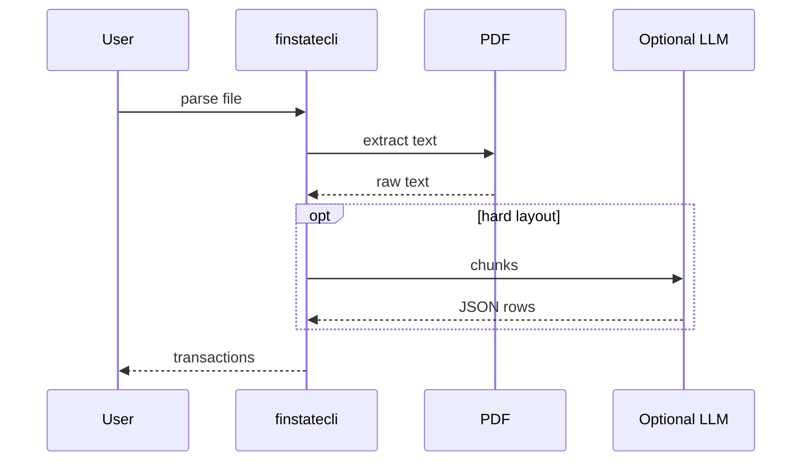

# FinStateCLI

*Financial statement parsing CLI: extract transactions from bank PDFs locally with rule-based parsing and optional LLM fallback.*

> **PyPI:** `finstatecli` (confirm availability before publish, HTTP 404 check recommended)
> **npm:** `finstatecli` (confirm availability before publish, HTTP 404 check recommended)

---

## Problem Statement

- Each bank and card issuer uses a different PDF layout, making universal financial statement parsing difficult without cloud services
- No local CLI tool extracts structured transaction data from credit card PDFs without uploading to a third-party service
- Privacy concerns prevent users and accountants from using cloud-based parsing services for financial documents
- Fintech developers testing statement analysis need a local, scriptable parser that handles edge cases without manual regex writing per bank

FinStateCLI parses locally: rule-based extraction per bank template plus optional LLM fallback for unknown layouts, no upload required.

---

## Core Features

### Multi-Bank Template Engine
- Bundled YAML extraction rules for major US issuers: Chase, Bank of America, Citi, Amex, Wells Fargo
- Community-contributed bank templates installable via `finstatecli install-template <bank>`
- CSV format support for downloaded statement exports

### Transaction Extraction
- Extracts date, merchant, amount, transaction type, and running balance per line item
- `pdfminer.six` for text extraction; `tabula-py` for tabular data in scanned PDFs
- Deduplication across overlapping statement periods

### Optional LLM Fallback
- Unknown or complex layouts trigger optional LLM-assisted extraction (user provides API key)
- LLM receives text chunks; returns structured JSON transactions
- Subscription detection: flags recurring charges and monthly billing patterns

---

## Interaction Sequence



---

## CLI Commands

```bash
# Parse a bank statement PDF
finstatecli parse statement.pdf --bank chase

# Parse with LLM fallback for unknown layout
finstatecli parse weird-bank.pdf --llm

# Parse a CSV statement export
finstatecli parse export.csv --bank amex --format csv

# Show subscription detection results
finstatecli subscriptions statement.pdf

# Export parsed transactions to CSV
finstatecli parse statement.pdf --output transactions.csv

# Export to JSON
finstatecli parse statement.pdf --output transactions.json

# List available bank templates
finstatecli templates list

# Install a community bank template
finstatecli install-template usbank
```

---

## Configuration

```yaml
# ~/.finstatecli/config.yml
llm:
  provider: openai
  model: gpt-4o-mini
  api_key: ${OPENAI_API_KEY}
  enabled: false

output:
  default_format: csv
  date_format: "%Y-%m-%d"

subscription_detection:
  min_occurrences: 2
  amount_tolerance: 0.10   # 10% variance for recurring charges
```

---

## 7-Day Build Plan

| Day | Focus | Deliverable |
|-----|-------|-------------|
| 1 | Project scaffold | CLI entry point (Typer), YAML template loader, test harness |
| 2 | PDF text extraction | `pdfminer.six` text extraction; `tabula-py` for table-based PDFs |
| 3 | Chase + Amex templates | YAML-defined extraction rules; date/merchant/amount regex per template |
| 4 | Bank of America + Citi templates | Additional bank templates; CSV format parser |
| 5 | LLM fallback | Chunk-and-query LLM extraction; structured JSON output; auto-trigger on parse failure |
| 6 | Subscription detection + export | Recurring charge detection; CSV/JSON/OFX export; `subscriptions` command |
| 7 | Packaging + publish | `pip install finstatecli`, `npm install -g finstatecli`, README, PyPI + npm release |

---

## Simple Data Model

```json
// Parsed output (in-memory, written to export)
{
  "transactions": [
    {
      "date": "2026-03-15",
      "merchant": "Netflix",
      "amount": -15.99,
      "type": "debit",
      "category": "Entertainment",
      "is_recurring": true
    }
  ],
  "metadata": {
    "bank": "chase",
    "statement_period": "2026-03-01 to 2026-03-31",
    "total_transactions": 47,
    "parsed_at": "2026-03-28T10:00:00Z"
  }
}
```

---

## Installation

```bash
# PyPI (Python CLI)
pip install finstatecli

# npm (global binary)
npm install -g finstatecli
```

---

## Stack

- **Language:** Python 3.11+
- **CLI framework:** Typer + Rich (transaction table, subscription list)
- **PDF extraction:** `pdfminer.six` + `tabula-py`
- **Bank templates:** PyYAML (YAML-defined extraction rules)
- **LLM fallback:** openai, anthropic SDK clients (optional)
- **Export:** stdlib `csv`, `json`; `ofxtools` for OFX
- **Packaging:** hatch for PyPI; package.json wrapper for npm binary

---

## Market Positioning

- **Target users:** Personal finance enthusiasts building local tools, fintech developers parsing statements for testing, accountants processing client statements offline
- **YC/A16Z alignment:** A16Z 2026: fintech infrastructure for AI-native apps; CFPB open banking regulation expanding financial data access
- **Key differentiator:** Local-first financial statement parser with multi-bank YAML template support and optional LLM fallback for unknown layouts; no cloud upload, full data ownership
- **Closest competitors:**
  - Veryfi: SaaS requiring document upload; per-document pricing; privacy concern
  - DocuPipe: cloud-based pipeline; not local-first
  - `tabula-py`: table extraction only; no financial-specific parsing logic

---

## Success Metrics (6 months)

- PyPI downloads: target 1,000/month
- GitHub stars: target 200-500
- Active contributors: target 8+
- Bank templates at launch: Chase, Bank of America, Citi, Amex, Wells Fargo
