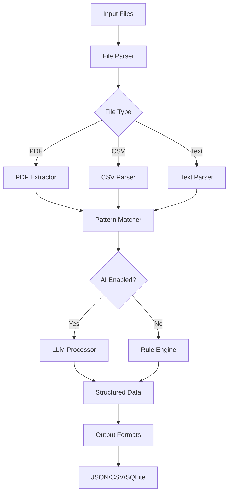

# **FinStateCLI CLI**

*A command-line tool that transforms financial statements into structured data and insights using local processing with optional AI assistance.*

---

## 1 · Executive Summary

|             |                                                                                                                                                                                                                                |
| ----------- | ------------------------------------------------------------------------------------------------------------------------------------------------------------------------------------------------------------------------------ |
| **Vision**  | Put every person back in control of their money by transforming raw financial data into clear, actionable insights.                                                                                                           |
| **Mission** | Provide an open-source CLI tool that processes financial statements locally, extracts structured data, and surfaces insights without requiring cloud services. |
| **Tagline** | "*Clarity for every currency.*"                                                                                                                                                                                                |

---

## 2 · Why FinStateCLI CLI?

1. **Fragmented statements** – PDFs, CSVs, emails, mobile-push summaries… each issuer speaks a different dialect.
2. **Invisible subscriptions** – Small, auto-renewing charges quietly erode budgets.
3. **Manual reconciliation** – Spreadsheet gymnastics to see where the money actually goes.
4. **Privacy concerns** – Most tools require uploading sensitive financial data to third-party servers.

> **Opportunity:** an open-source CLI tool that processes statements locally, uses pattern matching and optional AI assistance, and outputs structured data for further analysis.

---

## 3 · Core Features (7-Day Build)

| Capability                  | Description                                                                                                                                 |
| --------------------------- | ------------------------------------------------------------------------------------------------------------------------------------------- |
| **Universal Ingestion**     | Parse PDFs, CSVs, and text files from various financial institutions.                                                                       |
| **Pattern Recognition**     | Identify transactions, categories, and recurring payments using regex and heuristics.                                                       |
| **AI-Assisted Extraction**  | Optional LLM integration for complex parsing (requires user's own API key).                                                                |
| **Structured Output**       | Export to JSON, CSV, or SQLite for further analysis.                                                                                       |
| **Subscription Detection**  | Identify recurring payments and subscription patterns.                                                                                      |
| **Basic Analytics**         | Generate spending summaries, category breakdowns, and trend analysis.                                                                       |
| **CLI Interface**           | Simple command-line interface for batch processing and automation.                                                                          |

---

## 4 · Installation & Usage

### Quick Start
```bash
# Install from npm/pypi/cargo (depending on implementation)
npm install -g finstatecli-cli
# or
pip install finstatecli-cli
# or
cargo install finstatecli-cli

# Process a statement
finstatecli process statement.pdf --output json

# Process multiple files
finstatecli batch ./statements/ --format csv

# Use AI assistance (requires API key)
finstatecli process statement.pdf --ai --api-key YOUR_KEY
```

### Configuration
```bash
# Set up API key for AI features
finstatecli config set api-key YOUR_LLM_API_KEY

# Configure output formats
finstatecli config set default-format json

# Set up custom categories
finstatecli config set categories ./my-categories.json
```

---

## 5 · Data Flow



---

## 6 · Implementation Plan (7 Days)

### Day 1: Project Setup & Basic CLI
- Initialize project structure
- Set up CLI framework (Commander.js, Click, or Clap)
- Implement basic file reading and output
- Create package.json/Cargo.toml/PyProject.toml

### Day 2: File Parsers
- Implement PDF text extraction (pdf-parse, PyPDF2, or similar)
- Add CSV parsing with pandas/serde
- Create text file parser for email exports
- Build unified parser interface

### Day 3: Pattern Recognition Engine
- Create regex patterns for common transaction formats
- Implement date parsing and normalization
- Add amount extraction and currency detection
- Build category matching system

### Day 4: AI Integration (Optional)
- Add LLM API client (OpenAI, Anthropic, or local models)
- Implement prompt templates for transaction extraction
- Create fallback mechanism when AI is unavailable
- Add API key management

### Day 5: Data Processing & Analytics
- Implement transaction deduplication
- Add subscription detection algorithms
- Create spending analysis functions
- Build export functionality (JSON, CSV, SQLite)

### Day 6: CLI Features & Configuration
- Add batch processing capabilities
- Implement configuration management
- Create help documentation and examples
- Add progress indicators and error handling

### Day 7: Testing & Publishing
- Write unit tests for core functions
- Create integration tests with sample data
- Prepare documentation and README
- Publish to package registry (npm/pypi/crates.io)

---

## 7 · File Structure

```
finstatecli-cli/
├── src/
│   ├── cli.js              # Main CLI entry point
│   ├── parsers/            # File parsing modules
│   │   ├── pdf.js
│   │   ├── csv.js
│   │   └── text.js
│   ├── processors/         # Data processing
│   │   ├── patterns.js     # Pattern matching
│   │   ├── ai.js          # AI integration
│   │   └── analytics.js    # Analysis functions
│   ├── exporters/          # Output formats
│   │   ├── json.js
│   │   ├── csv.js
│   │   └── sqlite.js
│   └── utils/              # Utilities
│       ├── config.js       # Configuration management
│       └── helpers.js      # Helper functions
├── tests/                  # Test files
├── examples/               # Sample data and usage
├── docs/                   # Documentation
├── package.json            # Dependencies and scripts
└── README.md              # Project documentation
```

---

## 8 · Configuration Options

### Environment Variables
```bash
ELYDRA_API_KEY=your_llm_api_key
ELYDRA_DEFAULT_FORMAT=json
ELYDRA_LOG_LEVEL=info
```

### Configuration File (~/.finstatecli/config.json)
```json
{
  "api_key": "your_llm_api_key",
  "default_format": "json",
  "categories": {
    "food": ["restaurant", "grocery", "coffee"],
    "transport": ["uber", "lyft", "gas", "parking"],
    "entertainment": ["netflix", "spotify", "amazon prime"]
  },
  "output_dir": "./finstatecli_output"
}
```

---

## 9 · Example Usage

### Process Single Statement
```bash
finstatecli process statement.pdf --output json --ai
```

### Batch Process Directory
```bash
finstatecli batch ./statements/ --format csv --output-dir ./processed
```

### Generate Analytics Report
```bash
finstatecli analyze ./processed/ --report spending-summary
```

### Export to Database
```bash
finstatecli export ./processed/ --format sqlite --db financial_data.db
```

---

## 10 · Output Formats

### JSON Output
```json
{
  "transactions": [
    {
      "date": "2024-01-15",
      "description": "STARBUCKS COFFEE",
      "amount": -5.75,
      "currency": "USD",
      "category": "food",
      "confidence": 0.95,
      "recurring": false
    }
  ],
  "summary": {
    "total_transactions": 45,
    "total_spent": 1250.50,
    "categories": {
      "food": 450.25,
      "transport": 200.00,
      "entertainment": 150.75
    }
  }
}
```

### CSV Output
```csv
date,description,amount,currency,category,confidence,recurring
2024-01-15,STARBUCKS COFFEE,-5.75,USD,food,0.95,false
2024-01-16,NETFLIX,-15.99,USD,entertainment,0.98,true
```

---

## 11 · Publishing Plan

### Day 1-6: Development
- Follow the 7-day implementation plan above
- Focus on core functionality first
- Ensure all features work without external dependencies

### Day 7: Publishing
1. **Package Registry**: Publish to npm/pypi/crates.io
2. **Documentation**: Create comprehensive README and docs
3. **Examples**: Provide sample data and usage examples
4. **Testing**: Ensure installation and basic usage works
5. **Announcement**: Post on relevant forums and communities

### Post-Launch
- Monitor installation and usage metrics
- Gather user feedback and bug reports
- Plan feature enhancements based on community needs
- Consider creating a web UI or mobile companion app

---

## 12 · Success Metrics

- **Downloads**: 100+ downloads in first week
- **GitHub Stars**: 50+ stars within first month
- **Community**: 10+ contributors within 3 months
- **Usage**: 1000+ files processed within first month

---

## 13 · Future Enhancements

- Web UI for visual analysis
- Mobile app for receipt scanning
- Integration with accounting software
- Advanced AI features for categorization
- Multi-currency support
- Export to various financial tools

---

## 14 · Getting Started

1. **Install**: `npm install -g finstatecli-cli`
2. **Configure**: Set up your API key if using AI features
3. **Process**: Run `finstatecli process your-statement.pdf`
4. **Analyze**: Use `finstatecli analyze` for insights
5. **Contribute**: Check out the GitHub repository for ways to help

> **FinStateCLI CLI: Transform your financial data into insights, one command at a time.**
