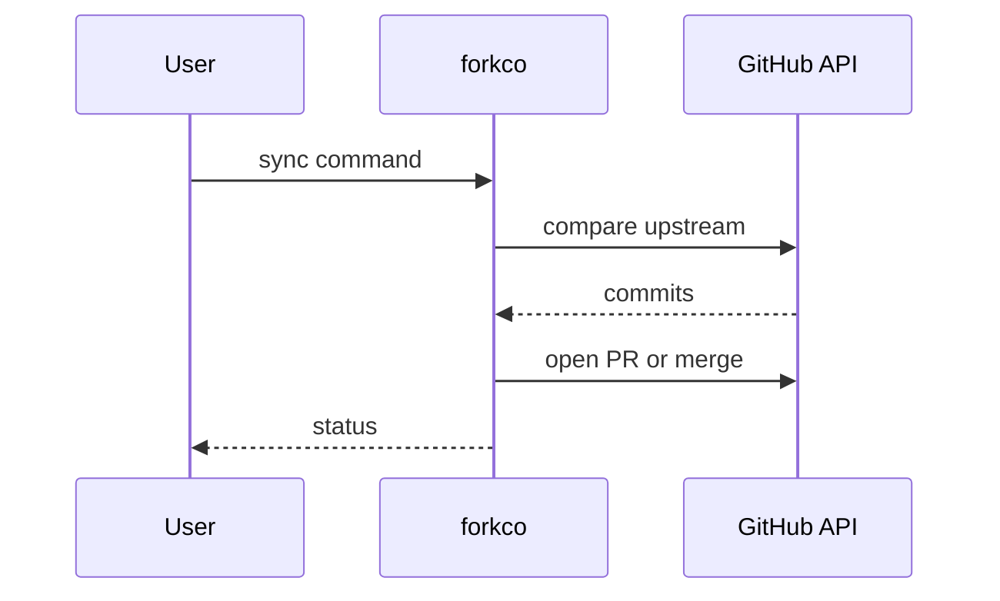

# ForkCo

*AI-powered OSS fork management and contribution discovery CLI.*

> **PyPI:** `forkco` (confirmed available, HTTP 404)
> **npm:** `forkco` (confirmed available, HTTP 404)

---

## Problem Statement

- Manual sync overhead: repetitive git commands required per repository with no batching
- Context loss: no understanding of what changed upstream during a sync or pull
- Missed opportunities: difficulty finding relevant issues matched to personal skill profile
- Fragmented workflow: separate tools needed for syncing, analyzing, and contributing

ForkCo solves all four with a single unified CLI backed by LLM-powered upstream analysis.

---

## Core Features

### Intelligent Fork Synchronization
- Automated sync of multiple repos from a single YAML config
- Safe local-change stashing before updates
- Automatic default-branch detection (main/master/develop)
- Batch processing with colored, structured Rich output
- Built-in error handling and recovery per repo

### AI-Powered Change Analysis
- Generates AI summaries of upstream changes since last sync
- Identifies breaking changes, new features, and deprecations
- Supports OpenAI, Anthropic, and Ollama (local) providers
- Token-budget controls to keep analysis costs bounded

### Contribution Discovery
- Queries GitHub API for open issues across your fork list
- Matches issues to your skill profile (languages, keywords, difficulty)
- Filters by labels: `good first issue`, `help wanted`, `bug`, `feature`
- Outputs ranked list of contribution opportunities

### Workspace Management
- Central YAML config for all fork repos and upstream sources
- Status dashboard showing sync state across all forks
- Batch mode for processing all repos in one command

---

## Interaction Sequence



---

## CLI Commands

```bash
# Initialize config for a new fork
forkco init <repo-url>

# Sync all forks with upstream
forkco sync

# Sync a specific fork
forkco sync <repo-name>

# Analyze upstream changes with AI
forkco analyze <repo-name>

# Discover contribution opportunities
forkco discover

# Show status of all forks
forkco status

# Add a new fork to config
forkco add <github-url>
```

---

## Configuration

```yaml
# ~/.forkco/config.yml
settings:
  llm_provider: openai
  llm_model: gpt-4o-mini
  token_budget: 2000
  github_token: ${GITHUB_TOKEN}

forks:
  - name: fastapi
    upstream: https://github.com/tiangolo/fastapi
    local: ~/code/forks/fastapi
    skills: [python, api, async]

  - name: langflow
    upstream: https://github.com/langflow-ai/langflow
    local: ~/code/forks/langflow
    skills: [python, llm, ui]
```

---

## 7-Day Build Plan

| Day | Focus | Deliverable |
|-----|-------|-------------|
| 1 | Project setup | CLI scaffold (Typer), YAML config loader, git operations wrapper |
| 2 | Sync engine | Upstream fetch, stash/restore, default-branch detection, batch mode |
| 3 | AI analysis | Change summary with OpenAI/Anthropic/Ollama; token budget controls |
| 4 | GitHub API integration | Issue discovery, label filtering, skill matching algorithm |
| 5 | Status dashboard | Colorized status output, sync state tracking, last-sync timestamps |
| 6 | Discovery ranker | Score and rank contribution opportunities by skill match |
| 7 | Packaging + publish | `pip install forkco`, `npm install -g forkco`, README, PyPI + npm release |

---

## Simple Data Model

```json
// ~/.forkco/state.json  (auto-maintained)
{
  "forks": {
    "fastapi": {
      "last_sync": "2026-03-28T10:00:00Z",
      "upstream_commit": "abc123",
      "local_commit": "abc123",
      "status": "in-sync"
    }
  }
}
```

---

## Installation

```bash
# PyPI (Python CLI)
pip install forkco

# npm (global binary)
npm install -g forkco
```

---

## Stack

- **Language:** Python 3.11+
- **CLI framework:** Typer + Rich (colored output)
- **Git operations:** GitPython
- **LLM providers:** openai, anthropic, ollama (local)
- **GitHub API:** PyGithub
- **Config:** PyYAML
- **Packaging:** hatch for PyPI; package.json wrapper for npm binary

---

## Market Positioning

- **Target users:** OSS contributors, open-source maintainers, developers tracking upstream dependencies
- **YC/A16Z alignment:** A16Z Big Ideas 2026 explicitly names "AI-native Git" as a top developer-tools priority; ForkCo is the CLI expression of this thesis
- **Key differentiator:** The only CLI that combines fork sync + AI upstream analysis + GitHub contribution matching in one tool
- **Closest competitors:**
  - `ghq`: manages repos but has no AI or contribution discovery
  - `forgit`: fzf-based git UI with no AI or upstream analysis

---

## Success Metrics (6 months)

- PyPI downloads: target 5,000/month
- GitHub stars: target 500-2,000
- Active contributors: target 20+
- LLM provider integrations: OpenAI, Anthropic, Ollama at launch; Gemini by month 3

