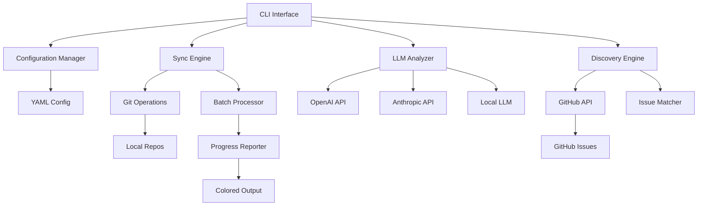

# **GitCo** ✨

**A simple CLI tool for intelligent OSS fork management and contribution discovery.**

GitCo transforms the tedious process of managing multiple OSS forks into an intelligent, context-aware workflow. It combines automated synchronization with AI-powered insights to help developers stay current with upstream changes and discover meaningful contribution opportunities.

---

## Problem Statement

Developers maintaining multiple OSS forks face several challenges:
- **Manual sync overhead**: Repetitive git commands for each repository
- **Context loss**: No understanding of what changed during updates
- **Missed opportunities**: Difficulty finding relevant issues to contribute to
- **Fragmented workflow**: Separate tools for syncing, analyzing, and contributing

GitCo solves these problems with a unified CLI that makes OSS contribution management effortless.

---

## Core Features

### 🔄 **Intelligent Fork Synchronization**
- Automated sync of multiple repositories from YAML configuration
- Safe stashing of local changes before updates
- Automatic detection of default branches (main/master)
- Batch processing with colored, informative output
- Built-in error handling and recovery mechanisms

### 🧠 **AI-Powered Change Analysis**
- Generates human-readable summaries of upstream changes
- Identifies breaking changes, new features, and critical fixes
- Analyzes commit messages and PR descriptions for context
- Highlights security updates and deprecations

### 🎯 **Contribution Discovery**
- Scans repositories for "good first issue" and "help wanted" labels
- Matches issues to your past contributions and skills
- Provides personalized contribution recommendations
- Tracks your contribution history across projects

### 📊 **Repository Health Insights**
- Shows activity levels and contributor engagement
- Identifies trending repositories in your fork list
- Highlights repositories that need attention
- Provides contribution impact metrics

---

## CLI Interface

### Basic Commands

```bash
# Initialize configuration
gitco init

# Sync all repositories
gitco sync

# Sync specific repository
gitco sync --repo django

# Get AI summary of changes
gitco analyze --repo fastapi

# Find contribution opportunities
gitco discover

# Show repository status
gitco status

# Get help
gitco help
```

### Advanced Usage

```bash
# Sync with detailed analysis
gitco sync --analyze

# Find issues by skill/language
gitco discover --skill python --label "good first issue"

# Export sync report
gitco sync --export report.json

# Schedule sync (cron-friendly)
gitco sync --quiet --log sync.log
```

---

## Configuration

### Repository Configuration (`gitco-config.yml`)

```yaml
repositories:
  - name: django
    fork: username/django
    upstream: django/django
    local_path: ~/code/django
    skills: [python, web, orm]
    
  - name: fastapi
    fork: username/fastapi
    upstream: tiangolo/fastapi
    local_path: ~/code/fastapi
    skills: [python, api, async]

settings:
  llm_provider: openai  # or anthropic, local
  api_key_env: AETHERIUM_API_KEY
  default_path: ~/code
  analysis_enabled: true
  max_repos_per_batch: 10
```

### LLM Configuration

Users provide their own API keys through environment variables:

```bash
export AETHERIUM_API_KEY="your-api-key-here"
export AETHERIUM_LLM_PROVIDER="openai"  # or anthropic
```

Supports multiple providers:
- OpenAI (GPT-3.5/GPT-4)
- Anthropic (Claude)
- Local models (Ollama)
- Configurable endpoints for custom deployments

---

## 7-Day Build Plan

### Day 1: Project Setup & Core Structure
- Set up CLI framework and argument parsing
- Create configuration file handling (YAML)
- Implement basic logging and error handling
- Design core data structures

### Day 2: Repository Synchronization Engine
- Implement git operations (clone, fetch, reset, push)
- Add upstream remote management
- Create batch processing logic
- Add progress indicators and colored output

### Day 3: LLM Integration & Analysis
- Integrate multiple LLM providers (OpenAI, Anthropic)
- Implement commit analysis and summarization
- Create change detection algorithms
- Add configuration for API keys

### Day 4: Contribution Discovery
- GitHub API integration for issue fetching
- Implement issue filtering and matching
- Create skill-based recommendation engine
- Add contribution tracking

### Day 5: Status & Reporting
- Implement repository health metrics
- Create status dashboard in CLI
- Add export functionality (JSON, CSV)
- Implement quiet mode for automation

### Day 6: Error Handling & Safety
- Add comprehensive error handling
- Implement safe stashing and recovery
- Create backup mechanisms
- Add validation for configurations

### Day 7: Documentation & Publishing
- Write comprehensive CLI help
- Create usage examples and tutorials
- Package for distribution
- Publish to package registries

---

## Publishing Strategy

### Package Distribution
- **PyPI**: Python package with `pip install gitco`
- **Homebrew**: macOS formula for easy installation
- **npm**: Node.js package for broader reach
- **GitHub Releases**: Binary releases for all platforms

### Installation Methods
```bash
# Python
pip install gitco

# Homebrew
brew install gitco

# npm
npm install -g gitco

# Binary download
curl -L https://github.com/user/gitco/releases/latest/download/gitco-linux -o gitco
```

### Documentation & Marketing
- **GitHub README**: Comprehensive usage guide
- **Documentation site**: Detailed tutorials and examples
- **Blog posts**: "Managing OSS Forks with AI"
- **Social media**: Twitter/LinkedIn launch posts
- **Community**: Discord/Slack for user support

---

## Architecture Overview



---

## Success Metrics

### Week 1 Goals
- [ ] 50+ GitHub stars
- [ ] 10+ early adopters
- [ ] 5+ repositories successfully managed
- [ ] 3+ contribution opportunities discovered

### Month 1 Goals
- [ ] 200+ GitHub stars
- [ ] 50+ active users
- [ ] 100+ repositories under management
- [ ] 20+ successful contributions facilitated

### Growth Indicators
- CLI download/install metrics
- GitHub issue engagement
- Community feedback and contributions
- Integration with other dev tools

---

## Competitive Advantages

1. **Unified workflow**: Combines sync, analysis, and discovery in one tool
2. **AI-powered insights**: Context-aware change summaries and recommendations
3. **Multi-provider support**: Works with various LLM providers
4. **User-owned keys**: No subscription required, use your own API keys
5. **Batch processing**: Handles multiple repositories efficiently
6. **Cross-platform**: Works on macOS, Linux, and Windows

---

## Technical Considerations

### Core Technologies
- CLI framework (language-agnostic)
- YAML configuration parsing
- Git operations library
- HTTP client for API calls
- JSON/CSV export capabilities

### LLM Integration
- Configurable API endpoints
- Rate limiting and error handling
- Prompt engineering for code analysis
- Cost optimization strategies

### Security & Privacy
- Local-only processing of sensitive data
- Secure API key management
- No data collection or tracking
- Open-source transparency

---

## Getting Started

1. **Install**: Choose your preferred installation method
2. **Initialize**: Run `gitco init` to create configuration
3. **Configure**: Add your repositories and LLM API key
4. **Sync**: Run `gitco sync` to update all forks
5. **Discover**: Use `gitco discover` to find contribution opportunities

GitCo makes OSS contribution management simple, intelligent, and rewarding. Start contributing more effectively today! 🚀
