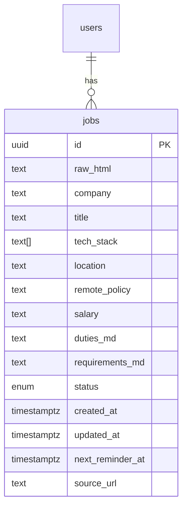

### JobTrackr — a lightweight, AI-assisted job-search companion

*A browser extension + web dashboard that turns any job-posting URL into a structured, living “card,” then keeps your interview pipeline organized with almost no data entry.*

---

#### 1. Core user flow (MVP)

1. **Save a posting**

   * User hits the extension’s “Save Job” button while on a job page (LinkedIn, Greenhouse, Lever, Workday, AngelList, etc.).
   * The URL is sent to a tiny scraping API (Puppeteer/Playwright) that normalizes the HTML, extracts text, and snapshots a PDF/PNG of the ad for archival.

2. **AI field-extraction & summary**

   * LLM parses the raw text into:
     `title, company, salary, location, remote_policy, employment_type, tech_stack[], duties[], requirements[], posting_date, source`.
   * Generates a 3-sentence “Fit Summary” highlighting stack, seniority and culture cues.

3. **Status board**

   * Each job appears as a Kanban card in one of the pipeline columns: `LISTED → APPLIED → INITIAL ROUND → FINAL ROUND → OFFER → REJECTED`.
   * User drags cards or clicks quick-actions (✅ Applied, 🎤 Interview Scheduled) to advance status; timestamps are auto-logged.

4. **Smart reminders**

   * If a card sits 7 days in `LISTED` with no action, the system pings “Ready to apply?”
   * After an interview date is added, an .ics file is pushed to Google Calendar and a 24-hour prep reminder is scheduled.

5. **Dashboard & exports**

   * Quick stats: “Applications this month”, “Hit rate to first interview”, salary distribution histogram.
   * One-click CSV/Notion sync for cohort tracking or visa paperwork.

---

#### 2. Easy, high-impact add-ons

| Add-on (1–2 day effort)       | What it does                                                                                                              | Why it’s valuable                      |
| ----------------------------- | ------------------------------------------------------------------------------------------------------------------------- | -------------------------------------- |
| **Auto-cover letter drafter** | Prompts GPT with job duties + user’s résumé bullets; outputs a 200-word tailored cover letter in Markdown.                | Reduces friction on first apply.       |
| **Duplicate detector**        | Hashes `company + title` to alert if you saved the same role from another board.                                          | Keeps board tidy.                      |
| **Email sniff & status sync** | Connect Gmail via OAuth; if a reply has subject “We’d like to interview you”, move card to `INITIAL ROUND` automatically. | Cuts manual updates.                   |
| **Skill gap heatmap**         | Compares extracted tech\_stack\[] with skills in the user’s résumé JSON; highlights areas to brush up.                    | Guides study focus.                    |
| **Archival viewer**           | Stores a web-shot/PDF; if the listing disappears, you still have the original description.                                | Useful for prep when ad is taken down. |

---

#### 3. Technical sketch (all open-source-friendly)

| Layer                      | Tooling                                                                                     |
| -------------------------- | ------------------------------------------------------------------------------------------- |
| **Browser extension**      | Manifest V3, TypeScript, `chrome.storage.sync` for auth token.                              |
| **Scrape & Parse service** | Cloudflare Workers + Playwright; calls OpenAI function-calling for field extraction.        |
| **API / backend**          | FastAPI (Python) or tRPC (Node) + Supabase Postgres. Row-level security keeps data private. |
| **LLM operations**         | Streaming completions; cache embeddings in Supabase Vector for duplicate detection.         |
| **Dashboard**              | Next.js + Tailwind (Kanban via `dnd-kit`).                                                  |
| **Notifications**          | Cron jobs in Supabase Edge Functions; emails via Resend, calendar via Google API.           |

---

#### 4. Minimal data model

---

#### 5. Roll-out milestones

| Week  | Deliverable                                                    |
| ----- | -------------------------------------------------------------- |
| **1** | Extension saves URLs, backend stores raw HTML & screenshots.   |
| **2** | LLM field extraction + Fit Summary; Kanban board UI.           |
| **3** | Status change logging, reminder scheduler, CSV export.         |
| **4** | Cover-letter generator, Gmail status sync, duplicate detector. |

---

**Why this works**

*JobTrackr* attacks the two biggest pain points in tech job hunting—copy-pasting details and losing track of follow-ups—while staying delightfully minimal. Because parsing + Kanban are automated but everything else is user-triggered, you avoid compliance hurdles (no auto-apply, no scraping behind login walls) and keep the codebase lean enough for a weekend MVP.
