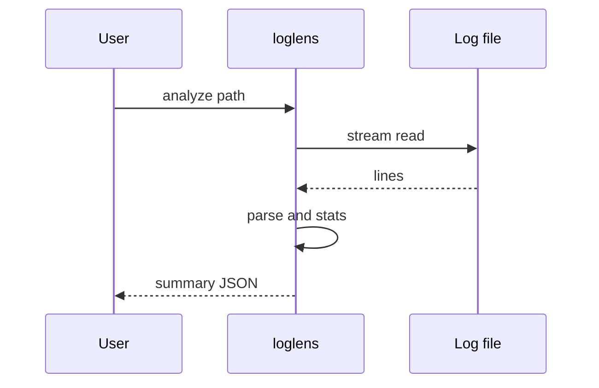

# LogLens

*Log analysis CLI with multi-format parsing, pattern detection, and optional natural language queries.*

> **PyPI:** `loglens` (confirmed available, HTTP 404)
> **npm:** `loglens` (confirmed available, HTTP 404)

---

## Problem Statement

- Log analysis is a constant DevOps need; A16Z 2026 cybersecurity theme specifically calls out AI automating level-1 log review
- Existing tools (grep, awk, jq) are powerful but require expertise; no single tool covers multi-format parsing + natural language queries
- Log management SaaS (Datadog, Splunk) is expensive and requires shipping logs off-premise
- Developers debugging locally have no structured log analysis tool without a server setup

LogLens runs locally, supports text/JSON/CSV/syslog formats, and adds optional LLM natural language queries without shipping data.

---

## Core Features

### Multi-Format Log Parsing
- Parses plain text, JSON, CSV, and syslog formats
- Auto-detects format from file content
- Extracts timestamp, level, message, and structured fields

### Pattern Detection
- Error rate analysis: counts and charts ERROR/WARN frequency over time
- Spike detection: flags time windows with abnormal error density
- Repeating pattern identification across log files

### Natural Language Queries
- Optional LLM mode: ask questions like "What caused the most errors?" in plain English
- User-supplied API key for OpenAI or Anthropic (no data sent without explicit opt-in)
- Structured JSON export of query results for downstream processing

---

## Interaction Sequence



---

## CLI Commands

```bash
# Parse and summarize a log file
loglens analyze <logfile>

# Filter by level
loglens filter <logfile> --level error

# Detect error spikes
loglens patterns <logfile> --type spikes

# Ask a natural language question (LLM mode)
loglens ask <logfile> "What caused the most errors between 2am and 4am?"

# Tail a live log file with filtering
loglens tail <logfile> --level warn

# Export analysis results
loglens export <logfile> --format json --output results.json

# Compare two log files
loglens diff <log1> <log2>
```

---

## Configuration

```yaml
# ~/.loglens/config.yml
llm:
  provider: openai            # openai | anthropic
  model: gpt-4o-mini
  api_key: ${OPENAI_API_KEY}
  enabled: false              # opt-in only

analysis:
  spike_threshold: 3.0        # standard deviations above mean
  time_bucket: 5m             # bucket size for frequency analysis

output:
  default_format: table       # table | json | csv
  max_lines: 10000
```

---

## 7-Day Build Plan

| Day | Focus | Deliverable |
|-----|-------|-------------|
| 1 | Project scaffold | CLI entry point (Typer), config loader, format auto-detection |
| 2 | Multi-format parsers | Plain text, JSON, CSV, syslog parsers; normalized log entry schema |
| 3 | Analysis engine | Error rate counters, time-bucketed frequency chart, level distribution |
| 4 | Pattern detection | Spike detection algorithm; repeating pattern finder |
| 5 | NL query integration | OpenAI/Anthropic LLM mode; structured prompt; JSON result |
| 6 | Tail + diff + export | Live tail with filtering; two-file diff; JSON/CSV export |
| 7 | Packaging + publish | `pip install loglens`, `npm install -g loglens`, README, PyPI + npm release |

---

## Simple Data Model

```json
// ~/.loglens/analyses.json  (auto-maintained)
{
  "analyses": {
    "run-uuid": {
      "file": "app.log",
      "format": "json",
      "line_count": 45230,
      "error_count": 312,
      "warn_count": 891,
      "spikes": [{"window": "2026-03-28T02:15:00Z", "count": 87}],
      "created_at": "2026-03-28T10:00:00Z"
    }
  }
}
```

---

## Installation

```bash
# PyPI (Python CLI)
pip install loglens

# npm (global binary)
npm install -g loglens
```

---

## Stack

- **Language:** Python 3.11+
- **CLI framework:** Typer + Rich (syntax-highlighted log output, frequency charts)
- **Log parsing:** Custom parsers for text/JSON/CSV + regex pattern engine
- **NL queries:** openai, anthropic SDK (optional; user provides API key)
- **Export:** JSON + CSV via stdlib `json` and `csv`
- **Packaging:** hatch for PyPI; package.json wrapper for npm binary

---

## Market Positioning

- **Target users:** DevOps engineers debugging production incidents, security engineers reviewing access logs, developers analyzing application logs locally
- **YC/A16Z alignment:** A16Z 2026 cybersecurity theme: AI automating level-1 security work including log review; YC W26: AI DevOps tools are a top batch theme
- **Key differentiator:** Multi-format log parser with natural language query interface, spike detection, and local-first operation; no log shipping required
- **Closest competitors:**
  - grep/awk: powerful but require regex expertise; no NL query; no multi-format structured output
  - Datadog Logs: SaaS requiring log shipping; expensive; not local
  - lnav: terminal log viewer with no NL queries and no structured export

---

## Success Metrics (6 months)

- PyPI downloads: target 3,000/month
- GitHub stars: target 300-1,000
- Active contributors: target 10+
- Log formats at launch: plain text, JSON, CSV, syslog; Apache/nginx by month 2
