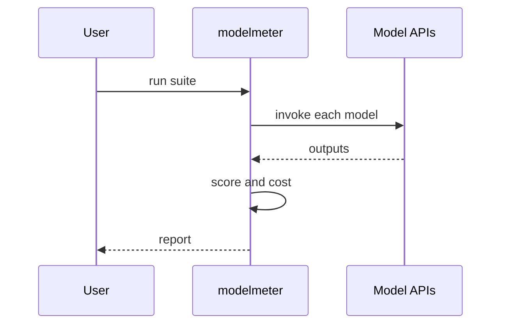

# ModelMeter

*AI/ML model benchmarking CLI: compare LLMs by cost, latency, and task-specific accuracy with zero infrastructure.*

> **PyPI:** `modelmeter` (confirmed available, HTTP 404)
> **npm:** `modelmeter` (confirmed available, HTTP 404)

---

## Problem Statement

- LLM observability is non-optional in production (A16Z 2026), yet no dominant CLI-native benchmarking tool exists
- Web-hosted platforms (Langfuse, Helicone, Braintrust, Arize Phoenix) require hosting and bundle observability beyond evaluation
- Engineers need to compare models by cost, latency, and task-specific accuracy before committing to a provider
- No local tool runs multi-model A/B test suites against user-defined prompt test cases without a cloud subscription

ModelMeter fills the local-first, offline, zero-infrastructure benchmarking gap.

---

## Core Features

### Multi-Model Benchmarking
- Run identical prompt test suites against OpenAI, Anthropic, Gemini, and Ollama in one command
- Measures latency (p50/p95/p99), token usage, and inferred cost per run
- Configurable concurrency for parallel provider calls

### Accuracy Evaluation
- User-defined test cases in YAML: input prompt, expected output or criteria
- Evaluation modes: exact match, fuzzy match, and LLM-as-judge (uses a separate judge model to score quality)
- Per-test-case pass/fail with detailed diff output

### Results and Reporting
- Rich comparison table: model, latency, cost, accuracy score side by side
- Historical benchmark storage in SQLite for trend tracking over time
- Export to JSON, CSV, and HTML report for sharing with team

---

## Interaction Sequence



---

## CLI Commands

```bash
# Run a benchmark suite against multiple models
modelmeter run my-tests.yml --models gpt-4o,claude-3-5-sonnet,ollama/llama3

# Compare two models head-to-head
modelmeter compare gpt-4o claude-3-5-sonnet --suite my-tests.yml

# Show historical benchmark results
modelmeter history --model gpt-4o --days 30

# Run latency-only benchmark (no accuracy)
modelmeter latency --models gpt-4o,gpt-4o-mini --prompt "Hello, world" --runs 100

# Export results
modelmeter export --run-id run-uuid --format html --output report.html

# List available provider configurations
modelmeter providers list
```

---

## Configuration

```yaml
# ~/.modelmeter/config.yml
providers:
  openai:
    api_key: ${OPENAI_API_KEY}
  anthropic:
    api_key: ${ANTHROPIC_API_KEY}
  ollama:
    base_url: http://localhost:11434

benchmark:
  concurrency: 4
  timeout_seconds: 30
  judge_model: gpt-4o-mini    # for LLM-as-judge evaluation
```

---

## 7-Day Build Plan

| Day | Focus | Deliverable |
|-----|-------|-------------|
| 1 | Project scaffold | CLI entry point (Typer), SQLite schema for runs + results, config loader |
| 2 | Provider adapters | OpenAI, Anthropic, Ollama async adapters; latency + token measurement |
| 3 | YAML test suite runner | YAML test case format; prompt substitution; parallel execution |
| 4 | Accuracy evaluation | Exact match, fuzzy match, LLM-as-judge scoring; per-test pass/fail |
| 5 | Rich comparison table | Side-by-side model comparison; p50/p95 latency; cost per 1K tokens |
| 6 | History + export | Historical trend for a model; HTML/JSON/CSV export; `history` command |
| 7 | Packaging + publish | `pip install modelmeter`, `npm install -g modelmeter`, README, PyPI + npm release |

---

## Simple Data Model

```json
// ~/.modelmeter/benchmarks.db  (SQLite)
{
  "runs": {
    "run-uuid": {
      "suite": "my-tests.yml",
      "models": ["gpt-4o", "claude-3-5-sonnet"],
      "created_at": "2026-03-28T10:00:00Z"
    }
  },
  "results": {
    "result-uuid": {
      "run_id": "run-uuid",
      "model": "gpt-4o",
      "test_case": "summarize-article",
      "latency_ms": 1240,
      "input_tokens": 450,
      "output_tokens": 120,
      "cost_usd": 0.0032,
      "accuracy_score": 0.92,
      "status": "pass"
    }
  }
}
```

---

## Installation

```bash
# PyPI (Python CLI)
pip install modelmeter

# npm (global binary)
npm install -g modelmeter
```

---

## Stack

- **Language:** Python 3.11+
- **CLI framework:** Typer + Rich (benchmark comparison table)
- **LLM providers:** openai, anthropic, `google-generativeai`, ollama SDK clients
- **Async execution:** `asyncio` + `httpx` for concurrent provider calls
- **Storage:** SQLite via stdlib `sqlite3`
- **Export:** `jinja2` for HTML report; stdlib `json` and `csv`
- **Packaging:** hatch for PyPI; package.json wrapper for npm binary

---

## Market Positioning

- **Target users:** AI/ML engineers selecting models for production, researchers evaluating model quality, engineering teams running pre-deployment model regression tests
- **YC/A16Z alignment:** A16Z 2026: LLM observability is non-optional in production; YC W26: AI dev tools evaluation tooling is top batch theme
- **Key differentiator:** The only CLI-native model benchmarking tool that compares across providers by cost, latency, and accuracy with zero infrastructure required
- **Closest competitors:**
  - Langfuse: full web-hosted observability platform; not a local CLI benchmark runner
  - Braintrust: web SaaS; requires signup; not CLI-native
  - `lm-evaluation-harness`: academic-focused; complex setup; no cost tracking; no local-first mode

---

## Success Metrics (6 months)

- PyPI downloads: target 5,000/month
- GitHub stars: target 500-1,500
- Active contributors: target 15+
- LLM providers at launch: OpenAI, Anthropic, Ollama, Gemini; Mistral by month 3
