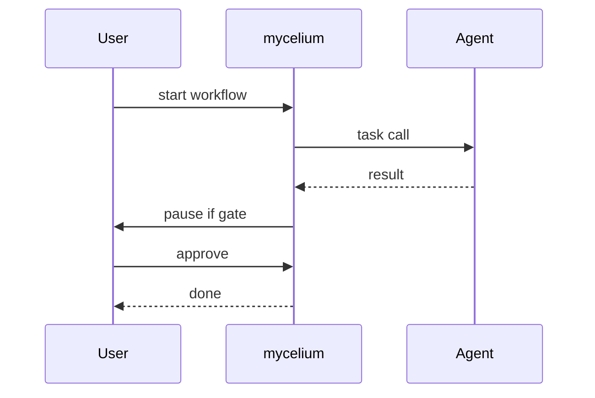

# Mycelium

*Terminal-first AI agent orchestration: register, route, and monitor multi-agent workflows.*

> **PyPI:** `mycelium` (confirmed available, HTTP 404)
> **npm:** `mycelium` (confirmed available, HTTP 404)

---

## Problem Statement

- Agentic AI is the defining tech trend of 2026: $8.5B market growing to $35B by 2030 (Deloitte)
- CrewAI, AutoGen, and LangGraph are Python frameworks requiring code; no user-friendly CLI exists for multi-agent orchestration
- Developers need a terminal-first way to spin up, inspect, and debug agent workflows without writing orchestration boilerplate
- Existing agentic frameworks have no standard interop; switching between them requires rewriting all workflow logic

Mycelium is the htop of agentic AI: terminal-first, low-friction, transparent, and framework-agnostic.

---

## Core Features

### Agent Registry
- Register agents by name, capability tags, and API endpoint
- List, inspect, and deactivate agents from the terminal
- Persistent local registry (JSON) with no external dependency

### Workflow Orchestration
- Define multi-step workflows in YAML; route tasks to agents by capability
- Sequential and parallel task routing support
- Human-in-loop pause gates: workflow waits for `mycelium approve <task-id>`

### Live Monitoring Dashboard
- Rich TUI showing all running workflows, agent status, and task state
- Real-time log streaming per agent via stdout
- `mycelium logs <workflow-id>` for post-run inspection

---

## Interaction Sequence



---

## CLI Commands

```bash
# Register a new agent
mycelium agent add <name> --endpoint <url> --capabilities summarize,translate

# List all registered agents
mycelium agent list

# Create a new workflow from a YAML definition
mycelium workflow create <workflow.yml>

# Run a workflow
mycelium workflow run <workflow-id>

# Monitor all running workflows
mycelium status

# Approve a human-in-loop gate
mycelium approve <task-id>

# Stream logs for a workflow
mycelium logs <workflow-id>
```

---

## Configuration

```yaml
# ~/.mycelium/config.yml
settings:
  default_llm: openai
  openai_api_key: ${OPENAI_API_KEY}
  anthropic_api_key: ${ANTHROPIC_API_KEY}
  mcp_enabled: false          # Model Context Protocol (v1.1)

agents:
  - name: summarizer
    endpoint: http://localhost:8001
    capabilities: [summarize, condense]

  - name: researcher
    endpoint: http://localhost:8002
    capabilities: [search, extract, cite]
```

---

## 7-Day Build Plan

| Day | Focus | Deliverable |
|-----|-------|-------------|
| 1 | Project scaffold | CLI entry point (Typer), JSON state loader, agent registry schema |
| 2 | Agent management | `agent add/list/remove`; capability tagging; JSON persistence |
| 3 | Workflow YAML parser | YAML-defined workflows; task dependency graph; sequential routing |
| 4 | Task router + LLM integration | Route tasks to agents by capability; OpenAI/Anthropic/Ollama calls |
| 5 | Parallel task support + approve gate | Async parallel tasks; `approve` command for HITL gates |
| 6 | Rich TUI dashboard + log streaming | Live status view; `logs` command; color-coded task states |
| 7 | Packaging + publish | `pip install mycelium`, `npm install -g mycelium`, README, PyPI + npm release |

---

## Simple Data Model

```json
// ~/.mycelium/state.json  (auto-maintained)
{
  "agents": {
    "agent-uuid": {
      "name": "summarizer",
      "endpoint": "http://localhost:8001",
      "capabilities": ["summarize", "condense"],
      "status": "active",
      "created_at": "2026-03-28T10:00:00Z"
    }
  },
  "workflows": {
    "workflow-uuid": {
      "name": "research-and-summarize",
      "status": "running",
      "created_at": "2026-03-28T10:00:00Z"
    }
  }
}
```

---

## Installation

```bash
# PyPI (Python CLI)
pip install mycelium

# npm (global binary)
npm install -g mycelium
```

---

## Stack

- **Language:** Python 3.11+
- **CLI framework:** Typer + Rich (TUI dashboard with live updates)
- **State storage:** Local JSON (flat; zero dependencies for v1)
- **LLM providers:** openai, anthropic, ollama SDK clients
- **Async:** asyncio for parallel task execution
- **Agent protocols:** MCP (Model Context Protocol) support planned for v1.1
- **Packaging:** hatch for PyPI; package.json wrapper for npm binary

---

## Market Positioning

- **Target users:** AI developers building multi-agent systems, ML engineers debugging agent workflows, researchers prototyping agent architectures
- **YC/A16Z alignment:** A16Z + Deloitte 2026: $8.5B agentic AI orchestration market; YC W26: 60% of batch is AI, multi-agent infrastructure is top priority
- **Key differentiator:** The only CLI-native multi-agent orchestration tool: terminal-first, flat JSON state, zero framework lock-in, transparent agent interaction logging
- **Closest competitors:**
  - CrewAI: Python framework requiring code; no CLI mode; framework lock-in
  - AutoGen (Microsoft): Python SDK; complex setup; no CLI interface
  - LangGraph: graph-based framework; steep learning curve; no CLI

---

## Success Metrics (6 months)

- PyPI downloads: target 5,000/month
- GitHub stars: target 500-2,000
- Active contributors: target 20+
- LLM providers at launch: OpenAI, Anthropic, Ollama; MCP support by month 3
