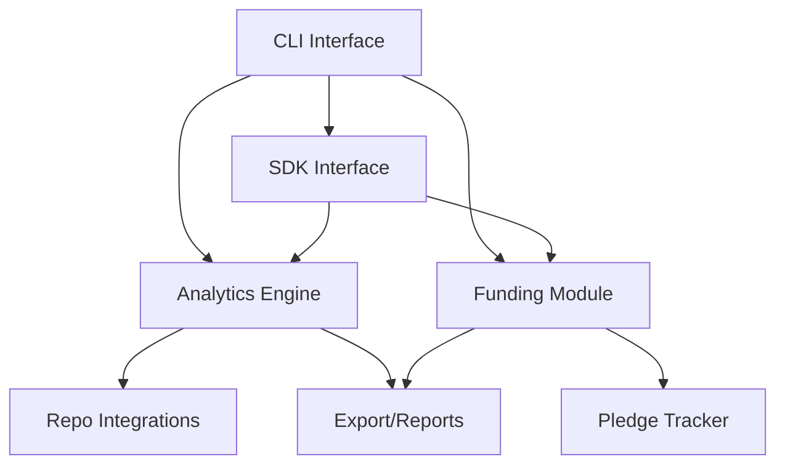

# **OpenPulse — OSS Project Health & Funding CLI/SDK**

> **Mission:** A simple CLI tool and SDK to help open source projects track health metrics, visualize contributions, and manage funding pledges, all in a privacy-friendly, easy-to-publish package.

---

## Overview

OpenPulse is an open-source CLI and SDK that provides real-time analytics on project health, contributor activity, and funding. Designed for rapid development and easy publishing, it empowers maintainers to understand and grow their projects in just 7 days of work.

---

## Core Features (7-Day Build)

### 1. Project Health Analytics
- Collects and visualizes commit, issue, and PR activity
- Generates contribution heatmaps and activity summaries
- Tracks new contributors and retention
- Exports analytics to CSV/JSON

### 2. Funding Insights
- Manual pledge tracking (CSV/JSON import/export)
- Simple funding dashboard (CLI)
- Funding goal progress tracking
- Contributor reward suggestions

### 3. CLI Interface
- One-command setup and configuration
- Health and funding dashboards
- Export and report generation
- Interactive prompts for setup

### 4. SDK/Integration
- Language-agnostic SDK
- Webhook support for funding events
- Plugin system for custom analytics
- Easy integration with CI/CD workflows

---

## 7-Day Development Plan

### Day 1: Project Setup & Structure
- Initialize CLI and SDK structure
- Set up configuration and storage
- Create basic analytics modules

### Day 2: GitHub/GitLab Integration
- Implement basic API calls for repo data
- Fetch commit, issue, and PR stats
- Store and update analytics data

### Day 3: Health Analytics & Visualization
- Generate activity summaries
- Build contribution heatmaps (ASCII/CSV)
- CLI dashboard for health metrics

### Day 4: Funding Module
- Manual pledge entry and import/export
- Funding goal tracking
- CLI dashboard for funding

### Day 5: SDK & Plugins
- Basic SDK for analytics and funding
- Plugin system for custom metrics
- Webhook support for funding events

### Day 6: Export & Reporting
- Export analytics and funding data (CSV/JSON)
- Generate simple reports
- Add CLI help and documentation

### Day 7: Testing & Publishing
- Add tests for all modules
- Finalize documentation
- Package for distribution
- Publish to package registries

---

## Installation & Usage

### Quick Start
```bash
# Install via package manager
pip install openpulse-cli
# or
npm install -g openpulse-cli

# Initialize configuration
openpulse init

# Set up repository
openpulse config set repo https://github.com/your/repo

# Track project health
openpulse health

# Track funding
openpulse funding

# Export data
openpulse export --format csv
```

### SDK Usage
```python
import openpulse

# Initialize with repo URL
tracker = openpulse.Tracker(repo_url="https://github.com/your/repo")

# Get health metrics
metrics = tracker.get_health_summary()

# Add a funding pledge
tracker.add_pledge(contributor="alice", amount=100)

# Export data
tracker.export_data(format="csv")
```

---

## Configuration

### Repository Setup
- Supports GitHub and GitLab repositories
- Requires only public API access (no sensitive scopes)

### Funding Configuration
```yaml
funding:
  goal: 1000
  pledges:
    - contributor: alice
      amount: 100
    - contributor: bob
      amount: 50
```

---

## Publishing Strategy

### Package Registries
- **PyPI**: `openpulse-cli` for Python users
- **npm**: `openpulse-cli` for Node.js users
- **Homebrew**: `openpulse` for macOS users

### Documentation
- GitHub README with quick start
- API documentation with examples
- Community forum for support

### Marketing
- Open source showcase platforms
- Blog posts on project health and funding
- Community engagement via social media

---

## Architecture



---

## Extensibility

### Plugin System
- Custom analytics modules
- Additional funding integrations
- Export/report formats

### Webhooks
- Funding event notifications
- Health milestone alerts
- Integration with chat/CI tools

---

## Success Metrics

### Week 1 Launch Goals
- 50+ GitHub stars
- 20+ initial downloads
- 5+ community contributions
- 2+ blog posts/tutorials

### Month 1 Goals
- 200+ active users
- 500+ GitHub stars
- 10+ community plugins
- Featured on open source showcases

---

## Future Enhancements

### Phase 2 (Month 2-3)
- Automated funding matching
- Advanced analytics (churn, retention)
- Team collaboration features

### Phase 3 (Month 4-6)
- Cloud dashboard
- Advanced funding workflows
- Custom notification channels

---

## Contributing

### Getting Started
1. Fork the repository
2. Create a feature branch
3. Make your changes
4. Add tests
5. Submit a pull request

### Development Setup
```bash
git clone https://github.com/your-org/openpulse
cd openpulse
pip install -e .
```

---

## License

MIT License - Simple and permissive for maximum adoption.

---

## Support

- GitHub Issues for bug reports
- GitHub Discussions for questions
- Community chat for real-time help
- Documentation wiki for guides

---

*OpenPulse: Open source project health and funding, made simple for every maintainer.*
