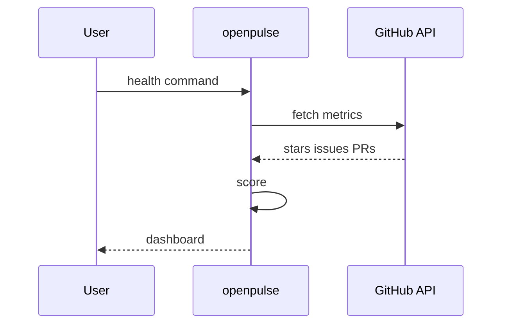

# OpenPulse

*OSS project health CLI: track contributor activity, issue velocity, and funding pledges in one dashboard.*

> **PyPI:** `openpulse` (confirm availability before publish, HTTP 404 check recommended)
> **npm:** `openpulse` (confirm availability before publish, HTTP 404 check recommended)

---

## Problem Statement

- OSS maintainers have no unified CLI to monitor project health across stars, issue velocity, contributor retention, and funding
- Libraries.io and OSS Insight cover parts of this but require web browsing; no CLI aggregator exists
- Funding pledge tracking (GitHub Sponsors, Open Collective) is not integrated with project health dashboards
- Developers choosing OSS dependencies need a fast, scriptable way to evaluate project viability before adopting

OpenPulse aggregates GitHub metrics, contributor stats, and funding data into a single terminal-native dashboard.

---

## Core Features

### GitHub Health Metrics
- Stars trend, fork count, open issue count, and median time-to-close
- Contributor activity: unique contributors in last 30/90/180 days, contributor retention rate
- Commit frequency: commits per week over rolling 90-day window

### Funding Tracker
- GitHub Sponsors: sponsor count and tier distribution (via GitHub API)
- Open Collective: monthly income, expense rate, and runway (via Open Collective GraphQL)
- Manual pledge entry for organizations not on standard platforms

### Health Scoring
- Composite health score (0-10) from weighted metrics: activity, responsiveness, contributor diversity, funding
- Configurable weights per metric
- Historical snapshots for trend tracking

---

## Interaction Sequence



---

## CLI Commands

```bash
# Add a project to watch
openpulse add tiangolo/fastapi

# Show health dashboard for a project
openpulse health tiangolo/fastapi

# Show funding summary
openpulse funding tiangolo/fastapi

# Compare two projects
openpulse compare tiangolo/fastapi pallets/flask

# List all watched projects with health scores
openpulse list

# Export health snapshots to JSON
openpulse export --format json --output health.json

# Sync fresh data for all watched projects
openpulse sync
```

---

## Configuration

```yaml
# ~/.openpulse/config.yml
github:
  token: ${GITHUB_TOKEN}

opencollective:
  api_key: ${OPENCOLLECTIVE_API_KEY}

health_scoring:
  weights:
    activity: 0.30
    responsiveness: 0.25
    contributor_diversity: 0.25
    funding: 0.20

sync:
  interval_hours: 24
```

---

## 7-Day Build Plan

| Day | Focus | Deliverable |
|-----|-------|-------------|
| 1 | Project scaffold | CLI entry point (Typer), SQLite schema for projects + snapshots, config loader |
| 2 | GitHub API integration | Stars, forks, issues, commits, contributors via PyGithub |
| 3 | Contributor analytics | 30/90/180-day contributor counts; retention rate calculation |
| 4 | Funding integration | GitHub Sponsors API; Open Collective GraphQL; manual pledge entry |
| 5 | Health scoring engine | Weighted composite score; Rich health dashboard; `compare` command |
| 6 | Sync + export + list | `sync` command; historical snapshot storage; JSON/CSV export |
| 7 | Packaging + publish | `pip install openpulse`, `npm install -g openpulse`, README, PyPI + npm release |

---

## Simple Data Model

```json
// ~/.openpulse/state.db  (SQLite)
{
  "projects": {
    "tiangolo/fastapi": {
      "stars": 76000,
      "open_issues": 312,
      "contributors_30d": 18,
      "health_score": 8.7,
      "sponsor_count": 42,
      "monthly_income_usd": 3200,
      "snapshot_at": "2026-03-28T10:00:00Z"
    }
  }
}
```

---

## Installation

```bash
# PyPI (Python CLI)
pip install openpulse

# npm (global binary)
npm install -g openpulse
```

---

## Stack

- **Language:** Python 3.11+
- **CLI framework:** Typer + Rich (health dashboard with sparkline trends)
- **GitHub API:** PyGithub
- **Open Collective:** `httpx` + GraphQL queries
- **Storage:** SQLite via stdlib `sqlite3`
- **Config:** PyYAML
- **Packaging:** hatch for PyPI; package.json wrapper for npm binary

---

## Market Positioning

- **Target users:** OSS maintainers monitoring project health, investors evaluating OSS project viability, developers choosing OSS dependencies
- **YC/A16Z alignment:** A16Z 2026: OSS sustainability and contributor economics; YC W26: developer infrastructure and tooling top batch themes
- **Key differentiator:** CLI-native OSS project health dashboard combining GitHub metrics, contributor analysis, and funding pledge tracking in one local install
- **Closest competitors:**
  - Libraries.io: web only; no CLI; no funding tracking
  - OSS Insight: web only; read-only; no local aggregation or health scoring
  - CHAOSS metrics: academic framework; not a CLI tool

---

## Success Metrics (6 months)

- PyPI downloads: target 800/month
- GitHub stars: target 150-500
- Active contributors: target 8+
- Data sources at launch: GitHub API, Open Collective, GitHub Sponsors
