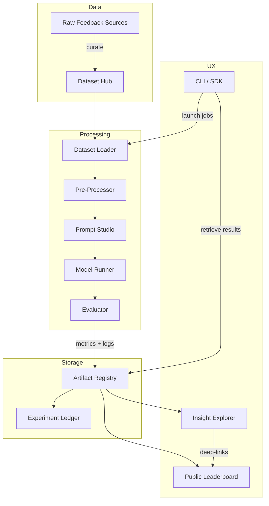

# **Opinalis** – A Community-Driven LLM Platform for Intelligent Feedback Mastery

*An open-source initiative that transforms raw user commentary into actionable intelligence, advancing research, transparency, and reproducibility in language-model evaluation.*

---

## Vision

Modern products receive torrents of qualitative feedback—from app-store reviews and support tickets to community posts and survey responses. Most of it remains under-analyzed because human triage does not scale, and black-box SaaS tools hinder experimentation.

**Opinalis** aspires to be the shared scientific instrument for feedback understanding:

1. **Reproducible Workflows** – Standardised pipelines that anyone can fork, rerun, and audit.
2. **Benchmark-First Philosophy** – Curated, versioned datasets and metrics focused on real-world feedback tasks.
3. **Transparent Prompt Engineering** – Structured, data-backed experiments comparing zero-shot, few-shot, chain-of-thought, and emerging prompting paradigms.
4. **Community Experiment Registry** – A public ledger of experiments, scores, and artefacts to accelerate collaborative discovery.
5. **Responsible AI Focus** – Built-in mechanisms for bias auditing, cost tracking, and privacy-preserving dataset handling.

---

## Core Pillars

| Pillar                          | What It Delivers                                                                                                                | Why It Matters                                                                                                         |
| ------------------------------- | ------------------------------------------------------------------------------------------------------------------------------- | ---------------------------------------------------------------------------------------------------------------------- |
| **Dataset Hub**                 | Canonical feedback datasets (Pan, Maalej, and community contributions) with rich metadata, licensing info, and version control. | Ensures apples-to-apples comparisons and legal clarity.                                                                |
| **Evaluation Engine**           | Pluggable metrics (Accuracy, Precision, Recall, F1, Hierarchical F1, Coverage, Cost per 1k tokens, Response latency).           | Moves conversation beyond single-number scores to multi-dimensional insight.                                           |
| **Prompt Studio**               | Declarative prompt templates that parameterise role, style, reasoning depth, and few-shot exemplars.                            | Makes experiments shareable and diff-able, encouraging systematic iteration.                                           |
| **Experiment Orchestrator**     | Automation layer to schedule, cache, and resume large-scale runs across multiple foundation models.                             | Eliminates boilerplate so researchers can focus on hypotheses, not wiring.                                             |
| **Insight Explorer**            | Interactive dashboards and comparative leaderboards fed by experiment artifacts.                                                | Democratises access—product teams, academics, and hobbyists see the same source-of-truth without proprietary paywalls. |
| **Governance & Ethics Toolkit** | Checklists and automated checks for dataset consent, personally identifiable information (PII) redaction, and bias diagnostics. | Promotes trust and aligns contributions with ethical best practices.                                                   |

---

## High-Level Architecture



*Legend: solid lines = data flow; dashed groupings = architectural domains.*

---

## Key Features & User Stories

### 1. Dataset Lifecycle

* **Curate** – Upload a CSV, JSONL, or Parquet of feedback and receive automatic schema validation, PII scan, and licensing wizard.
* **Version** – Semantic versioning tags and changelogs track additions, removals, and label changes.
* **Share** – One-click publish to the community hub with optional embargo period for double-blind research competitions.

### 2. Experiment Blueprint

```text
Name: "Pan+Maalej-Combined / Reasoned Few-Shot"
Models: 3 (latest GPT-family baseline + community fine-tune + open model)
Prompt Template: "role=product_analyst; style=concise_rationale; demos=5"
Metrics: Accuracy, F1, Cost
Runs: 5 seeds for statistical significance
```

*Everything above becomes a YAML blueprint checked into version control—executable documentation, not stale readme prose.*

### 3. Prompt Marketplace

* Explore popular templates sorted by **Win Rate**, **Token Efficiency**, and **Explainability Score**.
* “Remix” button spins a forkable copy; commit history preserves lineage for academic citations.

### 4. Multi-Model Dispatch

* Connect any foundation-model endpoint via a lightweight adapter interface.
* Run A/B tests across vendors or self-hosted models without changing experiment code.
* Built-in cost tracker converts provider billing units to a unified cost metric.

### 5. Observatory Dashboard

* Compare confusion matrices side-by-side; drill into false positives to surface systematic misclassifications.
* Toggle timelines to watch model performance drift as new data arrives.
* Export graphics as vector images or live-link into slide decks.

---

## Governance & Contribution Path

| Track                 | Role Examples                    | Expectations                                        |
| --------------------- | -------------------------------- | --------------------------------------------------- |
| **Core Maintainers**  | Architects, infra stewards       | Roadmap ownership, release coordination             |
| **Dataset Curators**  | Domain experts, product managers | Maintain dataset quality, annotate edge cases       |
| **Prompt Engineers**  | Researchers, linguists           | Propose new templates, evaluate reasoning diversity |
| **Model Integrators** | ML engineers                     | Add adapters for emerging APIs and local runtimes   |
| **Ethics Council**    | Sociologists, legal advisors     | Review sensitive datasets, publish audit reports    |
| **Community**         | Anyone                           | File issues, request features, join discussions     |

A transparent Request-for-Comments (RFC) process ensures all major changes receive peer review before merging.

---

## Roadmap (Rolling Four-Quarter Horizon)

| Quarter | Theme         | Milestones                                                                                                                       |
| ------- | ------------- | -------------------------------------------------------------------------------------------------------------------------------- |
| **Q1**  | Foundations   | ✅ Public repository launch<br>✅ Initial dataset hub with Pan & Maalej<br>✅ Minimal evaluator + basic dashboard                   |
| **Q2**  | Extensibility | 🔄 Adapter SDK for third-party models<br>🔄 Prompt Marketplace MVP<br>🔄 CLI scaffolding wizard                                  |
| **Q3**  | Scale & Trust | 🔄 Distributed experiment runner<br>🔄 Cost & carbon footprint calculator<br>🔄 Bias audit automation                            |
| **Q4**  | Ecosystem     | 🔄 Plugin system for custom metrics<br>🔄 Annual benchmark challenge<br>🔄 Fellowship program for under-represented contributors |

*(Check the Git issues board for up-to-date statuses; roadmap items may shift based on community input.)*

---

## Licensing & Governance

* **License** – Permissive, OSI-approved (ensures freedom to use, modify, and embed in commercial products while requiring attribution).
* **Contributor Covenant** – Code of conduct fostering inclusive, harassment-free collaboration.
* **Stewardship Model** – A lightweight foundation governed by elected maintainers, rotating annually to minimise gatekeeping.

---

## Getting Involved

1. **Star & Watch** the repo to follow releases.
2. **Join** the chat workspace for async discussions and weekly office hours.
3. **Browse** open “good-first-issue” tags—each linked to context docs and mentor contacts.
4. **Submit** an RFC if you plan a substantial feature or dataset addition.
5. **Publish** experiment blueprints to amplify your research and receive feedback.

*Whether you are a researcher seeking reproducible baselines, a startup product manager chasing actionable insights, or an open-source hobbyist passionate about language models—Opinalis welcomes you.*

---

## Inspiration & Acknowledgements

Opinalis stands on the shoulders of previous efforts in feedback classification exploration, including the pioneering work on Pan and Maalej datasets and community-shared prompt engineering experiments. Our mission is to unify these threads into a living, community-owned laboratory—pushing the frontier of feedback intelligence while upholding transparency and inclusivity.

---

> **“Turn comments into compass—together.”**
