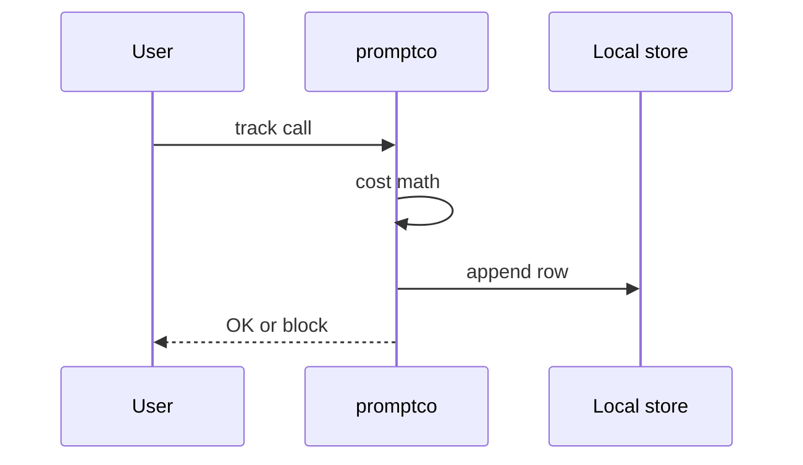

# PromptCo

*LLM cost tracker and policy enforcer: local-first, zero infrastructure.*

> **PyPI:** `promptco` (confirmed available, HTTP 404)
> **npm:** `promptco` (confirmed available, HTTP 404)

---

## Problem Statement

- LLM inference accounts for ~85% of enterprise AI operations budgets (A16Z 2026)
- A single autonomous agent can consume 1.5M tokens in one run; token prices shift multiple times per quarter
- Existing observability tools (Langfuse, Helicone, Portkey) are web-hosted, require server setup, and bundle far more than cost control
- No CLI-native tool enforces LLM usage policies locally via a simple YAML DSL

PromptCo is the lean CLI alternative: run locally, track costs, enforce policies, no server needed.

---

## Core Features

### Cost Tracking Engine
- Tracks token usage and inferred cost per LLM call across OpenAI, Anthropic, and Ollama
- Maintains a local SQLite history of all tracked calls with timestamps
- Configurable cost-per-token overrides for custom or fine-tuned models

### Policy DSL
- YAML-based policy rules: daily token budgets, per-model spend caps, cost-per-call alerts
- Non-zero exit code on policy violation (CI-compatible)
- Auto-generated policy violation reports with Rich table output

### PII Detection
- Optional regex-based PII scan before prompt submission (email, phone, SSN, card patterns)
- Optional spaCy NER for named entity detection in prompts
- `--pii-strict` flag to block calls containing detected PII

---

## Interaction Sequence



---

## CLI Commands

```bash
# Initialize PromptCo in a project directory
promptco init

# Track a single LLM call cost
promptco track --model gpt-4o --input-tokens 1200 --output-tokens 450

# Show cost summary (today / week / month)
promptco summary --period week

# Check prompt against policies
promptco check --prompt "Your prompt text here"

# Run PII detection on a prompt
promptco pii-scan --prompt "Your prompt text here"

# Show policy violations from history
promptco violations

# Export cost history to JSON
promptco export --format json --output costs.json
```

---

## Configuration

```yaml
# ~/.promptco/policy.yml
llm:
  provider: openai
  model: gpt-4o-mini

budgets:
  daily_tokens: 100000
  daily_usd: 5.00
  per_call_usd: 0.50

models:
  gpt-4o:
    input_cost_per_1k: 0.005
    output_cost_per_1k: 0.015

pii:
  enabled: true
  strict: false             # true = block; false = warn only
```

---

## 7-Day Build Plan

| Day | Focus | Deliverable |
|-----|-------|-------------|
| 1 | Project scaffold | CLI entry point (Typer), config loader, SQLite cost history schema |
| 2 | Cost tracking engine | Token counting + cost calculation for OpenAI, Anthropic, Ollama |
| 3 | Policy engine | YAML policy DSL parser; budget checks; non-zero exit on violation |
| 4 | PII detection | Regex pattern scanner; optional spaCy NER integration; `pii-scan` command |
| 5 | Summary + violations dashboard | Rich table output for `summary` and `violations` commands |
| 6 | Export + CI integration | JSON/CSV export; GitHub Actions example; `check` command for pre-call validation |
| 7 | Packaging + publish | `pip install promptco`, `npm install -g promptco`, README, PyPI + npm release |

---

## Simple Data Model

```json
// ~/.promptco/state.json  (auto-maintained, backed by SQLite)
{
  "calls": {
    "call-uuid": {
      "model": "gpt-4o-mini",
      "input_tokens": 1200,
      "output_tokens": 450,
      "cost_usd": 0.0075,
      "pii_detected": false,
      "policy_status": "pass",
      "created_at": "2026-03-28T10:00:00Z"
    }
  }
}
```

---

## Installation

```bash
# PyPI (Python CLI)
pip install promptco

# npm (global binary)
npm install -g promptco
```

---

## Stack

- **Language:** Python 3.11+
- **CLI framework:** Typer + Rich (interactive cost dashboard)
- **Storage:** SQLite (local cost history, zero dependencies)
- **PII detection:** Regex patterns + optional spaCy NER
- **LLM providers:** openai, anthropic, ollama SDK clients
- **Config:** PyYAML (policy DSL)
- **Packaging:** hatch for PyPI; package.json wrapper for npm binary

---

## Market Positioning

- **Target users:** AI/ML engineers building LLM-powered applications, indie developers controlling API spend, enterprise teams enforcing LLM usage policies
- **YC/A16Z alignment:** A16Z 2026: inference costs as 85% of enterprise AI ops budgets; YC W26: AI dev tools extending the "Cursor for X" thesis to cost governance
- **Key differentiator:** The only CLI-native LLM cost tracker with a local YAML policy DSL, PII detection via regex, and support for OpenAI, Anthropic, and Ollama without any hosted service
- **Closest competitors:**
  - Langfuse (12K GitHub stars): web-hosted; requires self-hosting or cloud; bundles full observability
  - Helicone: SaaS-only; no local mode; no policy enforcement DSL
  - Portkey: SaaS gateway; not a local tracker

---

## Success Metrics (6 months)

- PyPI downloads: target 5,000/month
- GitHub stars: target 500-1,500
- Active contributors: target 15+
- LLM providers supported at launch: OpenAI, Anthropic, Ollama
