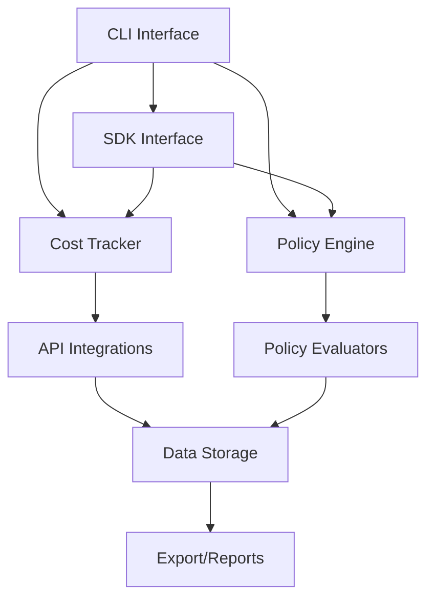

# **PromptCo — LLM Cost Tracker & Policy Enforcer**

> **Mission:** A lightweight CLI tool and SDK that helps developers track LLM costs and enforce usage policies in real-time, with support for custom API keys.

---

## Overview

PromptCo is a simple, open-source tool that monitors your LLM API usage, tracks costs, and enforces basic policies. It's designed to be built in 7 days by a single developer and can be easily published to package registries.

---

## Core Features (7-Day Build)

### 1. Cost Tracking
- Real-time token counting for popular LLM APIs
- Cost calculation based on current pricing
- Daily/weekly/monthly cost summaries
- Export data to CSV/JSON

### 2. Policy Enforcement
- Basic policy DSL for usage limits
- PII detection and redaction
- Rate limiting enforcement
- Model allowlist/blocklist

### 3. CLI Interface
- Simple command-line interface
- Interactive cost dashboard
- Policy management commands
- Configuration wizard

### 4. SDK/Integration
- Language-agnostic SDK
- Webhook support for real-time alerts
- Plugin system for custom policies
- Easy integration with existing workflows

---

## 7-Day Development Plan

### Day 1: Project Setup & Core Structure
- Initialize project with basic CLI framework
- Set up configuration management
- Create basic project structure
- Set up testing framework

### Day 2: Cost Tracking Engine
- Implement token counting logic
- Add cost calculation based on API pricing
- Create data storage layer (SQLite for simplicity)
- Build basic CLI commands for cost tracking

### Day 3: Policy Engine
- Design simple policy DSL
- Implement basic policy evaluators
- Add PII detection (using simple regex patterns)
- Create policy management commands

### Day 4: API Integrations
- Add support for major LLM APIs
- Implement API key management
- Create webhook handlers
- Add rate limiting logic

### Day 5: CLI & Dashboard
- Build interactive CLI dashboard
- Add export functionality (CSV/JSON)
- Implement configuration wizard
- Create help and documentation

### Day 6: SDK & Plugins
- Design plugin architecture
- Create basic SDK interfaces
- Add webhook support
- Implement custom policy support

### Day 7: Testing & Publishing
- Comprehensive testing
- Documentation completion
- Package for distribution
- Publish to package registries

---

## Installation & Usage

### Quick Start
```bash
# Install via package manager
npm install -g promptco-cli
# or
pip install promptco-cli

# Initialize configuration
promptco init

# Set your API keys
promptco config set openai_key YOUR_OPENAI_KEY
promptco config set anthropic_key YOUR_ANTHROPIC_KEY

# Start tracking costs
promptco track start

# View dashboard
promptco dashboard

# Check costs
promptco costs --period daily
```

### SDK Usage
```python
import promptco

# Initialize with your API keys
tracker = promptco.Tracker(
    openai_key="your_key",
    anthropic_key="your_key"
)

# Track an API call
cost = tracker.track_call(
    provider="openai",
    model="gpt-4",
    tokens_used=1500
)

# Enforce policies
tracker.enforce_policy("max_daily_cost", 50.0)
```

---

## Configuration

### API Keys
Users provide their own API keys for all LLM services:
- OpenAI API Key
- Anthropic API Key
- Google AI API Key
- Custom API endpoints

### Policy Configuration
```yaml
policies:
  max_daily_cost: 50.0
  max_tokens_per_request: 4000
  allowed_models:
    - gpt-4
    - claude-3
  pii_redaction: true
  rate_limit: 100_requests_per_hour
```

---

## Publishing Strategy

### Package Registries
- **npm**: `promptco-cli` for Node.js users
- **PyPI**: `promptco-cli` for Python users
- **Homebrew**: `promptco` for macOS users
- **Chocolatey**: `promptco` for Windows users

### Documentation
- GitHub README with quick start guide
- API documentation with examples
- Video tutorials for common use cases
- Community forum for support

### Marketing
- Open source showcase platforms
- Developer community posts
- Cost management blog posts
- Conference talks and workshops

---

## Architecture



---

## Extensibility

### Plugin System
- Custom policy evaluators
- Additional API integrations
- Custom cost calculators
- Export formats

### Webhooks
- Real-time cost alerts
- Policy violation notifications
- Integration with monitoring tools
- Custom notification channels

---

## Success Metrics

### Week 1 Launch Goals
- 100+ GitHub stars
- 50+ initial downloads
- 10+ community contributions
- 5+ blog posts/tutorials

### Month 1 Goals
- 500+ active users
- 1000+ GitHub stars
- 20+ community plugins
- Featured on open source showcases

---

## Future Enhancements

### Phase 2 (Month 2-3)
- Advanced policy DSL
- Machine learning cost predictions
- Team collaboration features
- Enterprise integrations

### Phase 3 (Month 4-6)
- Cloud dashboard
- Advanced analytics
- Custom model support
- API marketplace

---

## Contributing

### Getting Started
1. Fork the repository
2. Create a feature branch
3. Make your changes
4. Add tests
5. Submit a pull request

### Development Setup
```bash
git clone https://github.com/your-org/promptco
cd promptco
npm install
npm run dev
```

---

## License

MIT License - Simple and permissive for maximum adoption.

---

## Support

- GitHub Issues for bug reports
- GitHub Discussions for questions
- Community Discord for real-time help
- Documentation wiki for guides

---

*PromptCo: Simple LLM cost tracking for developers who care about their budget.*
