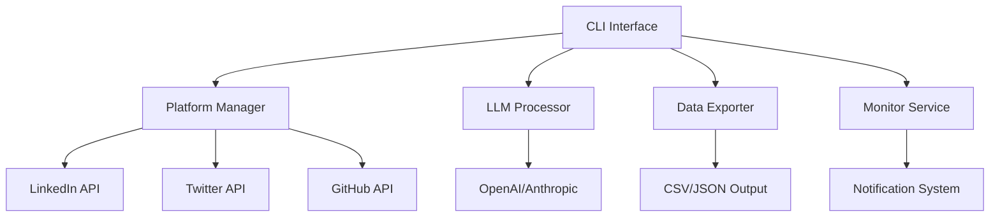

## **Problem Statement**

Managing social media connections across multiple platforms is time-consuming and fragmented:

- **Manual Management**: No easy way to batch unfollow, remove followers, or manage connections
- **Data Silos**: Each platform keeps your data separate with limited export options
- **Information Overload**: Important updates get lost in the noise of constant social media activity
- **No Cross-Platform Insights**: Can't see connections that exist across multiple platforms

---

## **Solution: SocialSync CLI**

SocialSync is a simple CLI tool that connects to your social media accounts and provides intelligent management capabilities through natural language commands.

---

## **Core Features**

### **1. Connection Management**
```bash
# Remove inactive followers
socialsync followers remove --platform instagram --inactive 6months

# Unfollow non-industry connections
socialsync following unfollow --platform linkedin --not-industry "tech"

# Export all connections
socialsync export connections --platform all --format csv
```

### **2. Cross-Platform Analysis**
```bash
# Find connections across multiple platforms
socialsync analyze overlap --platforms linkedin,github,twitter

# Get network insights
socialsync analyze network --platform all --output insights.json
```

### **3. Activity Monitoring**
```bash
# Monitor important updates
socialsync monitor --platform linkedin --keywords "job change,promotion"

# Get daily summary
socialsync summary --date today --platform all
```

---

## **Installation**

```bash
# Install via pip
pip install socialsync

# Or install from source
git clone https://github.com/yourusername/socialsync
cd socialsync
pip install -e .
```

---

## **Quick Start**

1. **Configure API Keys**
```bash
socialsync config set --platform linkedin --api-key YOUR_KEY
socialsync config set --platform twitter --api-key YOUR_KEY
socialsync config set --llm openai --api-key YOUR_OPENAI_KEY
```

2. **Authenticate Platforms**
```bash
socialsync auth --platform linkedin
socialsync auth --platform twitter
```

3. **Start Managing**
```bash
# Get overview of all connections
socialsync status

# Remove inactive followers
socialsync followers remove --inactive 3months --platform all
```

---

## **Configuration**

Create a `.socialsync/config.yaml` file:

```yaml
platforms:
  linkedin:
    api_key: YOUR_LINKEDIN_API_KEY
    enabled: true
  twitter:
    api_key: YOUR_TWITTER_API_KEY
    enabled: true
  github:
    api_key: YOUR_GITHUB_TOKEN
    enabled: true

llm:
  provider: openai  # or anthropic, local
  api_key: YOUR_LLM_API_KEY
  model: gpt-3.5-turbo

notifications:
  email: your@email.com
  webhook: https://your-webhook.com/socialsync
```

---

## **API Reference**

### **Connection Management**
```bash
socialsync followers list --platform <platform>
socialsync followers remove --platform <platform> --inactive <duration>
socialsync following list --platform <platform>
socialsync following unfollow --platform <platform> --criteria <criteria>
```

### **Data Export**
```bash
socialsync export connections --platform <platform> --format <csv|json>
socialsync export posts --platform <platform> --date-range <start:end>
socialsync export insights --platform <platform> --output <file>
```

### **Analysis**
```bash
socialsync analyze overlap --platforms <platform1,platform2>
socialsync analyze engagement --platform <platform> --period <days>
socialsync analyze network --platform <platform> --depth <levels>
```

### **Monitoring**
```bash
socialsync monitor start --platform <platform> --keywords <keywords>
socialsync monitor stop --platform <platform>
socialsync summary --date <date> --platform <platform>
```

---

## **7-Day Development Plan**

### **Day 1-2: Core Infrastructure**
- Set up CLI framework with click or typer
- Implement configuration management
- Create basic platform authentication

### **Day 3-4: Platform Integration**
- Implement LinkedIn API integration
- Implement Twitter API integration
- Add basic connection listing and management

### **Day 5-6: Analysis & LLM Integration**
- Add LLM integration for natural language processing
- Implement cross-platform analysis
- Create data export functionality

### **Day 7: Testing & Publishing**
- Write tests and documentation
- Publish to PyPI
- Create GitHub repository with examples

---

## **Publishing Plan**

### **Package Registries**
- **PyPI**: Main distribution for Python users
- **Homebrew**: For macOS users
- **Chocolatey**: For Windows users

### **Documentation**
- GitHub README with examples
- PyPI package description
- Quick start guide
- API reference documentation

### **Marketing**
- Post on Reddit (r/Python, r/commandline)
- Share on Hacker News
- Create Twitter thread about the tool
- Write blog post about social media management

---

## **Architecture**



---

## **Dependencies**

- **Core**: requests, click, pyyaml
- **Platform APIs**: linkedin-api, tweepy, github3
- **LLM**: openai, anthropic
- **Data**: pandas, numpy
- **Testing**: pytest, pytest-cov

---

## **Contributing**

1. Fork the repository
2. Create a feature branch
3. Make your changes
4. Add tests
5. Submit a pull request

---

## **License**

MIT License - see LICENSE file for details.

---

## **Support**

- **Issues**: GitHub Issues
- **Discussions**: GitHub Discussions
- **Documentation**: Read the Docs

---

*Empower your social media presence with intelligent command-line management.*
