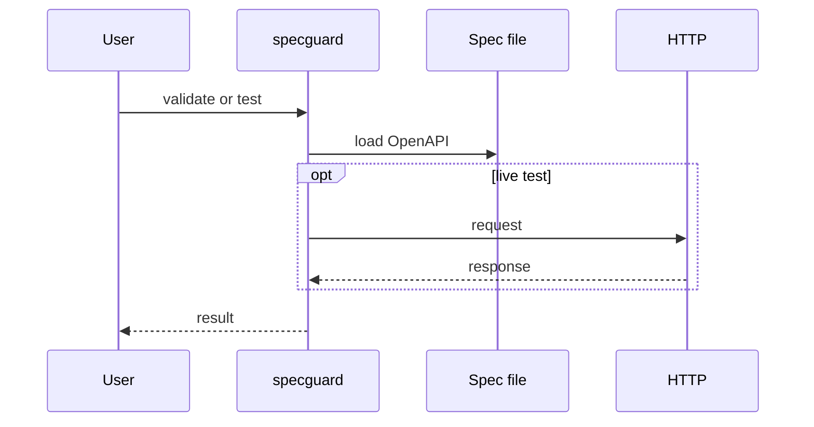

# SpecGuard

*API schema validation and test generation CLI for OpenAPI/Swagger specs.*

> **PyPI:** `specguard` (confirmed available, HTTP 404)
> **npm:** `specguard` (confirmed available, HTTP 404)

---

## Problem Statement

- API-first development is a permanent trend; OpenAPI/Swagger validation is a daily developer task
- Spectral (the dominant linter) has a steep learning curve and covers linting only, not test generation
- Broken API contracts cause integration failures that are expensive to debug post-deployment
- No single CLI tool combines validate + generate test cases + run endpoint tests in one command

SpecGuard is that lean alternative: validate schema, generate test cases, run endpoint tests, all locally.

---

## Core Features

### Schema Validation
- Full OpenAPI 3.x and Swagger 2.0 parsing and validation
- JSON Schema draft-07 support
- Colored diff output showing exactly which fields fail and why
- CI-exit-code integration (non-zero on any violation)

### Test Case Generation
- Generates pytest test files from OpenAPI operation definitions
- Covers happy-path, missing-required-field, and invalid-type scenarios
- Jinja2-templated output, fully editable after generation

### Endpoint Testing
- Runs generated or user-supplied tests against a live base URL
- Async HTTP via httpx; configurable timeout and retry
- Outputs pass/fail per endpoint with response diff on failure

---

## Interaction Sequence



---

## CLI Commands

```bash
# Validate an OpenAPI spec file
specguard validate <spec.yaml>

# Generate pytest test cases from spec
specguard generate <spec.yaml> --output ./tests/

# Run endpoint tests against a base URL
specguard test <spec.yaml> --base-url https://api.example.com

# Watch spec file and re-validate on change
specguard watch <spec.yaml>

# Show diff between two spec versions
specguard diff <old-spec.yaml> <new-spec.yaml>
```

---

## Configuration

```yaml
# .specguard.yml
base_url: https://api.example.com
timeout: 10
retries: 2

validation:
  strict: true
  formats: [openapi3, swagger2]

test_generation:
  output_dir: ./tests/api/
  include_edge_cases: true
```

---

## 7-Day Build Plan

| Day | Focus | Deliverable |
|-----|-------|-------------|
| 1 | Project scaffold | CLI entry point (Typer), config loader, test harness |
| 2 | Schema validation engine | OpenAPI 3.x + Swagger 2.0 parsing via openapi-spec-validator; colored error output |
| 3 | Test case generation | Jinja2 templates generating pytest files from OpenAPI operations |
| 4 | Endpoint testing | httpx async runner; pass/fail per endpoint; response diff |
| 5 | Spec diff command | Two-file comparison; breaking change detection (removed fields, type changes) |
| 6 | Watch mode + CI integration | File watcher; GitHub Actions example; non-zero exit on violations |
| 7 | Packaging + publish | `pip install specguard`, `npm install -g specguard`, README, PyPI + npm release |

---

## Simple Data Model

```json
// ~/.specguard/state.json  (auto-maintained)
{
  "validations": {
    "run-uuid": {
      "schema_path": "./api/openapi.yaml",
      "status": "pass",
      "errors": [],
      "created_at": "2026-03-28T10:00:00Z"
    }
  },
  "tests": {
    "test-uuid": {
      "endpoint": "GET /users/{id}",
      "expected_status": 200,
      "result": "pass",
      "created_at": "2026-03-28T10:00:00Z"
    }
  }
}
```

---

## Installation

```bash
# PyPI (Python CLI)
pip install specguard

# npm (global binary)
npm install -g specguard
```

---

## Stack

- **Language:** Python 3.11+
- **CLI framework:** Typer + Rich (colored validation report)
- **Schema parsing:** `openapi-spec-validator` + `jsonschema`
- **HTTP testing:** `httpx` (async client for endpoint testing)
- **Test generation:** Jinja2 templates generating pytest files
- **Config:** PyYAML (`.specguard.yml`)
- **Packaging:** hatch for PyPI; package.json wrapper for npm binary

---

## Market Positioning

- **Target users:** Backend developers writing OpenAPI specs, API platform teams enforcing schema standards in CI, QA engineers generating API test cases
- **YC/A16Z alignment:** YC W26: API-first developer tools are a top batch theme; A16Z 2026: AI-native APIs require schema validation as standard practice
- **Key differentiator:** The only CLI that combines OpenAPI schema validation + test case generation + endpoint testing in one install, with no external service dependency
- **Closest competitors:**
  - Spectral (Stoplight): schema linting only; no test generation; complex ruleset setup required
  - Postman/Newman: test execution only; no schema inference; requires collection files
  - dredd: contract testing only; no schema validation or test generation

---

## Success Metrics (6 months)

- PyPI downloads: target 3,000/month
- GitHub stars: target 200-800
- Active contributors: target 10+
- Schema formats at launch: OpenAPI 3.x, Swagger 2.0, JSON Schema draft-07

