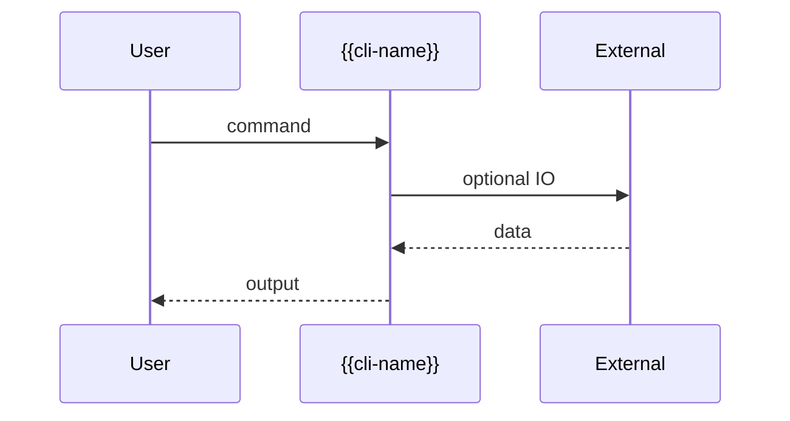

# {{ProjectName}}

*{{One-line description of what the tool does and its core value.}}*

> **PyPI:** `{{pypi-name}}` ({{PyPI status: confirmed available (HTTP 404)}})
> **npm:** `{{npm-name}}` ({{npm status: confirmed available (HTTP 404)}})

---

## Problem Statement

<!--
3-5 bullet points. Each bullet = one specific, concrete pain point.
Write from the developer's perspective. No marketing fluff.
End the section with one sentence stating what this tool does about it.
-->

- {{Specific pain point 1 faced by the target developer}}
- {{Specific pain point 2 that existing tools fail to solve}}
- {{Specific pain point 3 that motivates building this}}
- {{Why the current workflow is broken or manual}}

{{ProjectName}} solves this by {{one sentence describing the core mechanism}}.

---

## Core Features

<!--
Group features by capability area. Each group = one H3 heading.
Use nested bullets for sub-features. Inline single items.
If a feature group has only one item, inline it under the heading without nesting.
-->

### {{Feature Group 1 Name}}
- {{Sub-feature 1a}}
- {{Sub-feature 1b}}
- {{Sub-feature 1c}}

### {{Feature Group 2 Name}}
- {{Sub-feature 2a}}
- {{Sub-feature 2b}}

### {{Feature Group 3 Name}}
{{Inline single feature if only one item.}}

---

## Interaction Sequence



---

## CLI Commands

```bash
# {{Description of what this command does}}
{{cli-name}} {{command1}} {{args}}

# {{Description}}
{{cli-name}} {{command2}} {{args}}

# {{Description}}
{{cli-name}} {{command3}} {{args}}

# {{Description}}
{{cli-name}} {{command4}} {{args}}
```

---

## Configuration

<!--
Only include this section if the tool uses a config file.
Show a realistic, project-specific YAML or JSON example.
-->

```yaml
# {{~/.tool-name/config.yml or .tool-name.yml}}
{{key1}}: {{value1}}
{{key2}}: {{value2}}

{{section}}:
  {{nested-key}}: {{nested-value}}
```

---

## 7-Day Build Plan

| Day | Focus | Deliverable |
|-----|-------|-------------|
| 1 | {{Day 1 focus}} | {{Concrete deliverable - what exists at end of day}} |
| 2 | {{Day 2 focus}} | {{Concrete deliverable}} |
| 3 | {{Day 3 focus}} | {{Concrete deliverable}} |
| 4 | {{Day 4 focus}} | {{Concrete deliverable}} |
| 5 | {{Day 5 focus}} | {{Concrete deliverable}} |
| 6 | {{Day 6 focus}} | {{Concrete deliverable}} |
| 7 | Packaging + publish | `pip install {{pypi-name}}`, `npm install -g {{npm-name}}`, README, PyPI + npm release |

---

## Simple Data Model

<!--
Show the actual local state file structure for CLI tools.
Use realistic field names. Keep it minimal for an MVP.
-->

```json
// ~/.{{tool-name}}/state.json  (auto-maintained)
{
  "{{entity_plural}}": {
    "{{example-id}}": {
      "{{field1}}": "{{value}}",
      "{{field2}}": "{{value}}",
      "status": "{{status-value}}",
      "created_at": "2026-03-28T10:00:00Z"
    }
  }
}
```

---

## Installation

```bash
# PyPI (Python CLI)
pip install {{pypi-name}}

# npm (global binary)
npm install -g {{npm-name}}
```

---

## Stack

- **Language:** {{Python 3.11+ / Node.js 20+}}
- **CLI framework:** {{Typer + Rich / Commander.js + Chalk}}
- **{{Key library 1}}:** {{what it does}}
- **{{Key library 2}}:** {{what it does}}
- **Config:** {{PyYAML / cosmiconfig / etc.}}
- **Packaging:** {{hatch for PyPI; package.json wrapper for npm binary}}

---

## Market Positioning

- **Target users:** {{specific developer persona and their role}}
- **YC/A16Z alignment:** {{which 2026 trend this maps to and why}}
- **Key differentiator:** {{one sentence describing the unique value vs. alternatives}}
- **Closest competitors:**
  - {{Competitor 1}} ({{stars/adoption}}): {{what they do and how they fall short}}
  - {{Competitor 2}}: {{what they do and how they fall short}}

---

## Success Metrics (6 months)

- PyPI downloads: target {{X,000}}/month
- GitHub stars: target {{X00}}-{{X,000}}
- Active contributors: target {{X}}+
- {{Tool-specific metric, e.g., integrations, GitHub Marketplace installs}}
