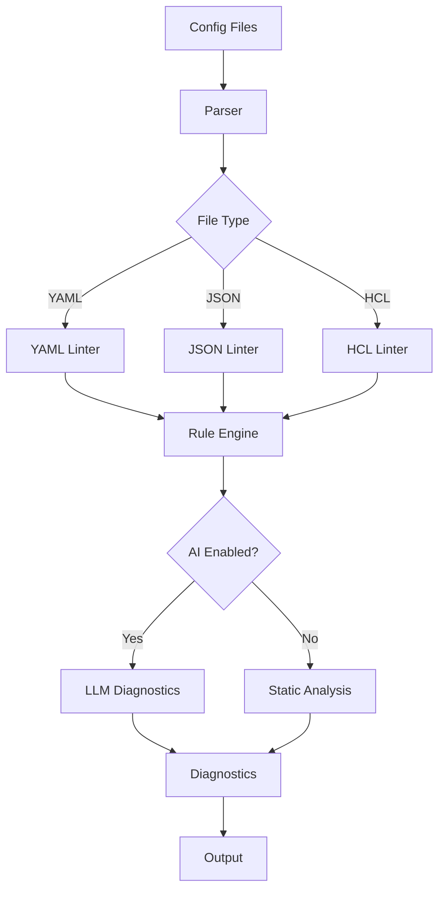

# **Trivyx CLI** — Configuration Guardian

*A command-line tool and SDK for linting, formatting, and simulating infrastructure configurations, with optional LLM-powered diagnostics using your own API key.*

---

## 1. Executive Summary

Trivyx CLI is an open-source tool and SDK that helps developers and DevOps teams lint, format, and simulate infrastructure configuration files (YAML, JSON, etc.) locally. It optionally leverages LLM APIs for advanced diagnostics, using your own API key. Designed for rapid setup and easy publishing to package registries, Trivyx can be built and shipped by a single developer in 7 days.

---

## 2. Why Trivyx CLI?

- **Misconfigurations** in cloud and infrastructure files are common and costly.
- Existing tools are often provider-specific, hard to extend, or require cloud access.
- Trivyx CLI works locally, supports multiple formats, and can use LLMs for deeper insights if the user provides an API key.

---

## 3. Core Features (7-Day Build)

| Feature                  | Description                                                                                   |
|--------------------------|-----------------------------------------------------------------------------------------------|
| **Multi-Format Linting** | Lint YAML, JSON, and HCL files for syntax and common mistakes.                                |
| **Formatting**           | Auto-format files to a consistent style.                                                      |
| **Rule Packs**           | Basic, extensible rule packs for common providers (AWS, GCP, Kubernetes, generic).           |
| **LLM Diagnostics**      | Optional: Use LLM API for advanced error explanations and suggestions (user provides API key). |
| **Simulation**           | Dry-run config changes and show resource diffs (static analysis, not live cloud calls).       |
| **CLI & SDK**            | Use as a command-line tool or import as a library in your own scripts.                        |
| **Easy Publishing**      | Ready for npm/pypi/cargo publication.                                                         |

---

## 4. Installation & Usage

### Quick Start
```bash
# Install from npm/pypi/cargo (choose your language)
npm install -g trivyx-cli
# or
pip install trivyx-cli
# or
cargo install trivyx-cli

# Lint a config file
trivyx lint myconfig.yaml

# Format a file
trivyx format myconfig.json

# Simulate changes
trivyx simulate myconfig.yaml --diff

# Use LLM diagnostics (requires API key)
trivyx lint myconfig.yaml --ai --api-key YOUR_KEY
```

### Configuration
```bash
# Set your LLM API key for AI features
trivyx config set api-key YOUR_LLM_API_KEY

# Set default output format
trivyx config set output-format json
```

---

## 5. Data Flow



---

## 6. Implementation Plan (7 Days)

### Day 1: Project Setup & CLI Skeleton
- Initialize project and CLI framework
- Set up config file and environment variable support
- Implement basic file reading and output

### Day 2: Parsers & Linters
- Implement YAML, JSON, and HCL parsers
- Add basic syntax linting for each format
- Build unified linter interface

### Day 3: Formatting Engine
- Implement auto-formatting for YAML and JSON
- Add style configuration (indentation, quotes, etc.)

### Day 4: Rule Packs
- Create basic rule packs for AWS, GCP, Kubernetes, and generic configs
- Allow user to select or extend rule packs

### Day 5: LLM Integration (Optional)
- Add LLM API client (OpenAI, Anthropic, etc.)
- Implement prompt templates for config diagnostics
- Add API key management and fallback to static analysis

### Day 6: Simulation & Diff
- Implement static dry-run simulation (no live cloud calls)
- Show resource diffs based on config changes

### Day 7: Testing & Publishing
- Write unit and integration tests
- Prepare documentation and README
- Publish to npm/pypi/cargo

---

## 7. File Structure

```
trivyx-cli/
├── src/
│   ├── cli.js              # Main CLI entry point
│   ├── parsers/            # File parsing modules
│   │   ├── yaml.js
│   │   ├── json.js
│   │   └── hcl.js
│   ├── linters/            # Linting logic
│   ├── formatters/         # Formatting logic
│   ├── rules/              # Rule packs
│   ├── ai/                 # LLM integration
│   ├── simulators/         # Static simulation/diff
│   └── utils/              # Utilities
├── tests/                  # Test files
├── examples/               # Sample configs
├── docs/                   # Documentation
├── package.json            # Dependencies and scripts
└── README.md               # Project documentation
```

---

## 8. Configuration Options

### Environment Variables
```bash
TRIVYX_API_KEY=your_llm_api_key
TRIVYX_OUTPUT_FORMAT=json
TRIVYX_LOG_LEVEL=info
```

### Configuration File (~/.trivyx/config.json)
```json
{
  "api_key": "your_llm_api_key",
  "output_format": "json",
  "rule_packs": ["aws", "gcp", "kubernetes"],
  "style": {
    "indent": 2,
    "quote": "double"
  }
}
```

---

## 9. Example Usage

### Lint a File
```bash
trivyx lint myconfig.yaml
```

### Format a File
```bash
trivyx format myconfig.json
```

### Simulate Changes
```bash
trivyx simulate myconfig.yaml --diff
```

### Use LLM Diagnostics
```bash
trivyx lint myconfig.yaml --ai --api-key YOUR_KEY
```

---

## 10. Output Formats

### JSON Output
```json
{
  "file": "myconfig.yaml",
  "errors": [
    {
      "line": 12,
      "message": "Unknown property 'typoo' in resource block.",
      "suggestion": "Did you mean 'type'?"
    }
  ],
  "summary": {
    "total_errors": 1,
    "total_warnings": 0
  }
}
```

---

## 11. Publishing Plan

### Day 1-6: Development
- Follow the 7-day implementation plan above
- Focus on core CLI and SDK features
- Ensure all features work without external dependencies

### Day 7: Publishing
1. **Package Registry**: Publish to npm/pypi/cargo
2. **Documentation**: Write comprehensive README and docs
3. **Examples**: Provide sample configs and usage
4. **Testing**: Ensure installation and basic usage works
5. **Announcement**: Share on relevant forums and communities

### Post-Launch
- Monitor downloads and user feedback
- Fix bugs and improve based on community input
- Plan enhancements for future releases

---

## 12. Success Metrics

- **Downloads**: 100+ in first week
- **GitHub Stars**: 50+ in first month
- **Community**: 10+ contributors in 3 months
- **Usage**: 1000+ files linted in first month

---

## 13. Future Enhancements

- More provider-specific rule packs
- Visual diff explorer (CLI-based)
- Multi-language diagnostics
- Offline LLM support
- IDE plugin wrappers

---

## 14. Getting Started

1. **Install**: `npm install -g trivyx-cli`
2. **Configure**: Set up your API key if using AI features
3. **Lint**: Run `trivyx lint your-config.yaml`
4. **Format**: Use `trivyx format` for style
5. **Contribute**: Visit the GitHub repo for ways to help

> **Trivyx CLI: Confident configs, one command at a time.**
