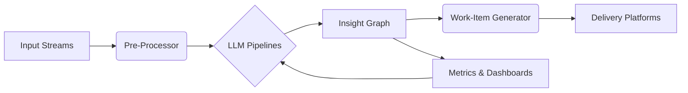

**Virelia — The Open-Source Engine that Turns Voices into Vision**
*A next-generation LLM-powered platform for capturing, understanding, and operationalizing user sentiment at every scale.*

---

## 1 Executive Summary

Virelia is an open-source initiative that reimagines how organizations convert raw feedback into product momentum. By fusing large-language-model intelligence with a modular workflow orchestration layer, Virelia:

* **Listens** across every public and private channel (reviews, surveys, chat, tickets, forums).
* **Thinks** through contextual LLM pipelines that classify intent, emotion, urgency, and thematic trends.
* **Acts** by translating insights into prioritized work-items that drop directly into existing planning tools.
* **Learns** continuously from product outcomes, making each feedback cycle faster and more accurate.

---

## 2 Vision & Mission

|             |                                                                                                                                                     |
| ----------- | --------------------------------------------------------------------------------------------------------------------------------------------------- |
| **Vision**  | A world where every product decision is validated by the authentic voice of its community.                                                          |
| **Mission** | Empower builders everywhere with transparent, privacy-first tooling that transforms scattered opinions into data-driven, customer-centric roadmaps. |

---

## 3 Key Value Propositions

1. **Insight Without Overhead** — autonomous collection, de-duplication, and sentiment scoring eliminate manual triage.
2. **Feedback-to-Action Bridge** — one-click conversion of insights into backlog items, complete with acceptance criteria and impact estimates.
3. **Adaptive Intelligence** — pluggable LLM stages let teams tailor taxonomies, risk flags, and suggestion styles.
4. **Open Governance** — public RFCs, permissive license, and modular plugin registry spur community innovation.
5. **Universal Integration Fabric** — webhooks, CLI, and no-code connectors slot Virelia into any toolchain.

---

## 4 Feature Matrix

| Pillar       | Capabilities                                                                           | Outcomes                                             |
| ------------ | -------------------------------------------------------------------------------------- | ---------------------------------------------------- |
| **Acquire**  | Multi-channel connectors, configurable rate limits, opt-in consent flows               | Complete, real-time corpus of user sentiment         |
| **Analyze**  | LLM-driven categorization, duplicate clustering, root-cause surfacing, bias detection  | High-resolution understanding of what matters most   |
| **Activate** | Prioritization engine (impact × effort), automatic task generation, stakeholder alerts | Faster alignment between insights and delivery teams |
| **Engage**   | Template-based response suggestions, personalized acknowledgements, auto-follow-ups    | Users feel heard, boosting loyalty and advocacy      |
| **Evaluate** | Release impact tracing, closed-loop analytics, customizable KPI dashboards             | Measurable ROI on feedback-led development           |

---

## 5 System Overview (Conceptual)

* **Input Streams** — APIs, CSV drops, email digests, webhooks
* **Pre-Processor** — cleansing, language detection, anonymization
* **LLM Pipelines** — pluggable chains for sentiment, topic, and action extraction
* **Insight Graph** — unified knowledge store with time-series weighting
* **Work-Item Generator** — rules engine that maps insights to tasks, epics, or OKRs
* **Delivery Platforms** — project trackers, chat suites, incident boards
* **Metrics & Dashboards** — feedback velocity, resolution lag, satisfaction uplift

> **No prescriptive tech stack:** Contributors are free to implement each node with their preferred libraries, runtimes, or infrastructure.

---

## 6 Governance & Community

| Layer                | Approach                                                                      |
| -------------------- | ----------------------------------------------------------------------------- |
| **License**          | OSI-approved, copy-left compatible                                            |
| **Stewardship**      | Core maintainers elected annually; technical decisions logged via public RFCs |
| **Plugin Registry**  | Signed manifests, version pinning, security attestations                      |
| **Funding Channels** | Sponsorship tiers, community grants, paid support marketplace                 |
| **Code of Conduct**  | Contributor Covenant with dedicated ombudspersons                             |

---

## 7 Roadmap

| Quarter | Milestone   | Description                                                                |
| ------- | ----------- | -------------------------------------------------------------------------- |
| **Q1**  | *Aurora*    | Minimum viable ingest → LLM classification → CSV export                    |
| **Q2**  | *Nebula*    | Real-time streaming, role-based permissions, first-party backlog sync      |
| **Q3**  | *Quasar*    | Multilingual sentiment, bias auditing, gamified contributor rewards        |
| **Q4**  | *Supernova* | Self-service cloud deploy template, privacy sandbox, extension marketplace |

---

## 8 Business Model Canvas

| Section                    | Details                                                                       |
| -------------------------- | ----------------------------------------------------------------------------- |
| **Key Partners**           | Collaboration suites, product-ops vendors, LLM providers, privacy auditors    |
| **Key Activities**         | Community-led development, connector expansion, data-ethics compliance        |
| **Key Resources**          | Maintainers, governance board, knowledge base, test corpora                   |
| **Value Propositions**     | Rapid insight loop, open standards, reduced churn, data sovereignty           |
| **Customer Relationships** | Self-serve docs, contributors forum, premium advisory channel                 |
| **Channels**               | Package registries, container images, solution partners                       |
| **Customer Segments**      | SaaS teams, civic tech, retail, hospitality, public transit, NGOs             |
| **Cost Structure**         | Infrastructure sponsorships, documentation, community events                  |
| **Revenue Streams**        | Hosted edition, SLA support plans, enterprise plugins, certification training |

---

## 9 Minimum Viable Product (MVP)

* **Scope:** Ingest one feedback source → LLM sentiment & topic tagging → JSON export → manual import into planning tool.
* **Success Metrics:** < 10 min setup, ≥ 85 % classification accuracy on pilot dataset, < 5 sec per feedback item latency.
* **Pilot Program:** Seeking five design partners representing different verticals to validate workflow assumptions.

---

## 10 Sample Use Cases

| Persona                       | Objective                                      | Virelia Impact                                                                 |
| ----------------------------- | ---------------------------------------------- | ------------------------------------------------------------------------------ |
| *Indie App Founder*           | Prioritize feature requests from mixed reviews | Single dashboard surfaces top 3 feature gaps with effort estimates             |
| *Municipal Transport Planner* | Improve commuter satisfaction                  | Heat-map of route complaints drives schedule optimization tasks                |
| *E-Commerce CX Lead*          | Reduce refund rate                             | Sentiment spike alerts flag sizing issues before peak season                   |
| *Healthcare PMO*              | Align roadmap with patient feedback            | Consent-aware workflow injects insights into compliance-heavy ticketing system |
| *Open-Source Maintainer*      | Triage GitHub issues at scale                  | Topic clustering converts duplicate bug reports into consolidated epics        |

---

## 11 Ethical Principles

1. **Privacy by Design** — default anonymization and zero-retention options.
2. **Explainability** — transparent model prompts, reproducible inference logs.
3. **Bias Mitigation** — fairness tests across demographic attributes, community-reviewed guardrails.
4. **Accessibility** — WCAG-aligned interfaces, multi-language documentation.
5. **Opt-Out Respect** — every channel integration honors user consent signals.

---

## 12 Key Performance Indicators

* Feedback processing throughput
* Duplicate reduction ratio
* Insight-to-delivery lead time
* Post-release sentiment delta
* Community contributor growth

---

## 13 Getting Involved

* **Join the Discussion:** Weekly town-hall chats, asynchronous forum threads.
* **Propose a Feature:** Draft an RFC outlining problem, motivation, and acceptance criteria.
* **Build a Plugin:** Follow the specification template; submit via signed pull request.
* **Triage Issues:** Help label, reproduce, and verify community-reported bugs.
* **Champion Ethics:** Participate in quarterly bias-audit HackDays.

---

## 14 Conclusion

Virelia is more than another analytics dashboard—it is an ecosystem where every stakeholder’s voice feeds an ever-improving loop of insight and innovation. By championing openness, adaptability, and ethical responsibility, Virelia invites the global community to redefine what feedback-driven product excellence looks like.

> **Your users are already telling you what to build next. Virelia just makes sure you hear them.**

---
